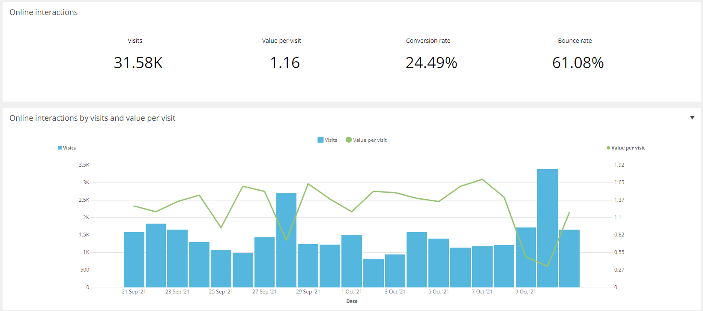
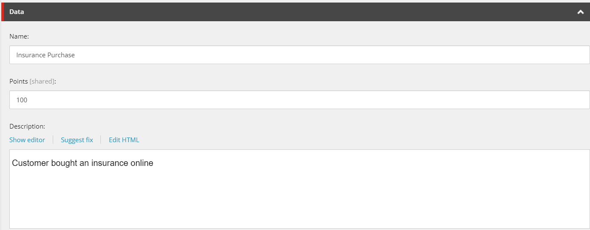
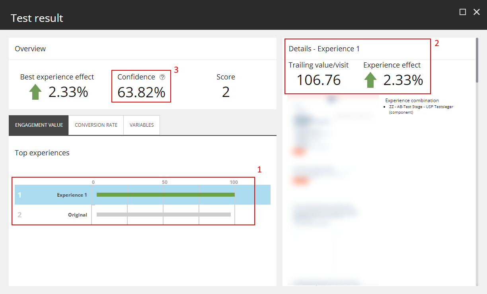
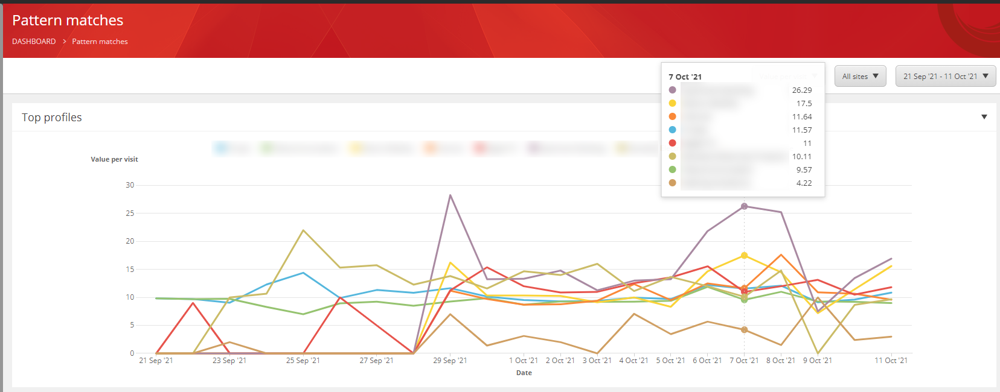
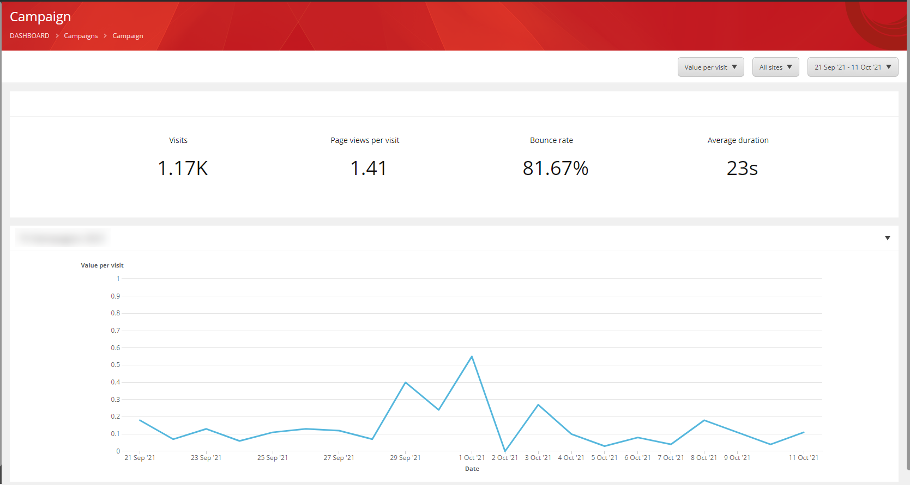

# The engagement value: What it is and how to use it
One of the most interesting concepts of Sitecore XP is the engagement value. Many marketers struggle with understanding engagement value and its benefits. This article will outline what the engagement value is, how it is determined, what distinguishes it from classical metrics (like visits and impressions) and how you can use it to measure site performance and identify leads.

## What is the engagement value?
The engagement value is the single most important KPI in the Sitecore Experience Platform and measures the engagement of a contact with your website. It is a numeric score that aggregates for each contact over time, based on business goals defined by your organization. In general: The higher the engagement value, the better.
 
## How is the engagement value calculated?
The engagement value is an integer that aggregates for each contact over time. The most common way of increasing the engagement value is to create a goal in Sitecore and assign it to an action, like visiting a certain page or submitting a form. The engagement value of a contact tells you how valuable this contact is for your organization, while the value per visit (= average change in engagement value per website visit) tells you how successful your website is in achieving your business goals.

## Why would you need the engagement value?
Let’s look at a few examples and compare how the engagement value behaves compared to classical metrics.
We assume you are an insurance company and sell 3 different insurance products online. Naturally, your primary goal is to sell insurances, so your first step is assigning a goal to the purchase action (I will not go into details on how you assign it technically, just assume that the goal is triggered upon purchase of an insurance). Since this is your primary goal, you assign it relatively high engagement points of 100, meaning that triggering this goal will increase a visitors engagement value by 100.

 
Let us now assume that - on average - 2 in every 100 website visitors buy an insurance on your website; your value per visit is therefore 2. Note how this simple value does a multitude of things:
•	It is directly tied to business value and therefore more suited to evaluate the performance of your website than classical KPIs like visitors, unique visitors, bounce rate etc.
•	It measures the success of your website in a tangible and consistent way throughout all pages 
•	It gives you a baseline that you can use to measure how changes in your content influence the success of your website
Let us now assume that you decide to experiment a bit and replace a car insurance teaser on your homepage with a household insurance teaser. It is probable that this change will increase the number of household insurances purchased, while decreasing the number of car insurances sold. How do you put those changes in relation to determine whether the experiment is successful? You don’t have to, the engagement value – or rather the value per visit – does it for you:
•	If the value per visit increases, you sell more insurances overall
•	If the value per visit decreases, you sell less insurances overall
Note that there might very well be some additional cross-effects that you did not account for, like an increase or decrease in the sales of the third insurance type. The power of the engagement value is how it breaks down the complexity of user behavior into a simple numeric value that allows a qualified conclusion about your experiments – measured across your whole website.

## How to use the engagement value
I mentioned earlier that the engagement value is the most important KPI in Sitecore XP, so it is no surprise that it appears in many different places throughout Sitecore. Let’s have a look. 

### A/B – Testing
When you run an A/B – or multivariate test, Sitecore will assess its success based on the Trailing value/visit, which is the average collected engagement value after being exposed to the test. The logic behind this is: If there is a significant engagement value difference between the variations of your content, it can be attributed to the content the visitors see. Consider this test result:

 
You can determine from that test result that
1.	There are 2 variations on this page
Experience 1 and Original
2.	The Experience 1 looks like it performs slightly better
It has a Trailing value/visit of 107.76, which is a 2.33% improvement over the Original
3.	The Confidence is 63.82%
This is not statistically relevant, meaning it is quite possible that the uplift is by chance. You would need to let this test run longer to increase the confidence and be certain that the engagement value increase can be attributed to the alternate content in this test

## Personalization
When using personalization, you can create a test and utilize the engagement value exactly as in A/B – tests to measure success. Note that none of the conditions find their way into the test, only the resulting displayed variants. In other words, it does not matter why a visitor saw a certain variant, only whether the variant he saw influenced the trailing value/visit.

### Analytics
As the engagement value is the most important KPI in Sitecore XP, it is expected that it appears all over the Sitecore Analytics. Note that this value correlates to business value, which makes Sitecore Analytics very business focused.

## Profiling
Sitecore can tell you which profiles are contributing most to your engagement value.

 
You can see that visitors with the yellow profile collect on average 16.98 engagement points per visit, while visitors with the purple profile only collect 9.38. You can also dig deeper to see how these values develop over time.
 

In this diagram, you can see that the purple profile is particularly successful over time, generating an all-time-high average of more than 25 engagement points per visit. You can decide to either cater to your more successful profiles or try to make your content more attractive for less successful profiles.

### Campaigns
You can compare the success of campaigns by looking at the engagement scores relative to non-campaign visitors.

 
If you compare the numbers in this campaign to the regular dashboard (first screenshot), you can see that – despite the significantly higher bounce rate and extremely short visit duration– the value per visit is 1.41 and hence higher than the overall average of 1.16.

### Pages
It might be very interesting to know the most successful pages and their respective business value. A great way of evaluating the success of a page is – you guessed it – through the engagement value.

 
In this diagram, you can see that the most successful pages are dark yellow and purple, as visits with those two pages have an average value per visit that is 4-8 times higher than the average. This should give you a pretty good idea which pages work well on your website.

## Experience Profile
I mentioned earlier that the engagement value is calculated for each contact, so naturally you can also look at it from a visitor perspective. The Experience Profile is the place where you can find all visitors and identify the ones with the highest engagement.

 
If you look at this list, one visitor stands out: With a high engagement value of 700 and 38 visits so far. This visitor seems to be a very good candidate to hand over to your sales department to follow up on.

## Conclusion
For me, the engagement value is one of the most powerful concepts of Sitecore. It focuses heavily on business value, is easy to use and simplifies complex tasks like evaluating the success of a test or campaign to a simple number comparison. It can be used consistently throughout your whole website to assess the value of your content and your contacts and supports your marketers in focusing on the right aspects of your online presence. Whether you can use the Sitecore Marketing features correctly depends on whether you understand the engagement value.

## FAQ
Use this FAQ to verify your understanding of the engagement value or come back if you have a question.

#### Why would I use something like the engagement value when I can look at each goal separately?
The idea of the engagement value is to get a holistic view over the effects of your content changes. When you look at separate goals it is easy to neglect unintended negative side effects that your changes might incur elsewhere. In addition, your marketers might not know or understand all the goals of your website, so having a simple numeric value simplifies the evaluation of your experiments.

#### Do I have to use the engagement value?
No, you can always look at each goal separately. Note that this might complicate the use of Sitecore Analytics and some other built-in functionality.

#### I have 2 products with very different profits. How do I reflect that in Sitecore?
You should define 2 separate goals with different engagement scores that are relative to the business value, e.g., 100 engagement points for the more profitable product and 60 for the less profitable one.

#### I have added a new product to my offering that has a higher profit than any other, but my most engaging goal has already 100 points. What should I do?
Just create a new goal and give it more than 100 engagement points, e.g., 120. The 100 points suggestion is not a hard limit, but a value from experience that allows to later add goals that are either more or less valuable.

#### I have a contact with an engagement value of 250. Is that a lot?
That depends completely on your setup, engagement values are not comparable. If your average value per visit is 2, then it probably is. If your average value per visit is 150, then it is probably not.

#### I have never used the engagement value or created any goals so far, how should I start?
You should start by creating goals for visitor actions with the highest business value. If you sell products, purchases should be your first goals. If you provide a service, finishing a contact form might be your first goal. Aim to give your first goals engagement points of around 100.

#### I also want to increase the engagement value when visitors visit my product pages. Is that a problem?
No, in general you can also define goals and increase the engagement value for passive events, such as viewing a page. Try not to pollute your environment with too many of these goals since it increases complexity and might impact the significance of your engagement value. Make sure to give passive events (like viewing a page) a much lower engagement value than active events (like buying something or registering for a newsletter).

#### I replaced a generic teaser on my home page with a product promotion, but my value/visit declined. How is that possible?
Promoting a certain product often leads to reduced visibility of other products. A decline in value/visit indicates that the uplift in the sales of the promoted product does not compensate for the reduced sales of other products.
