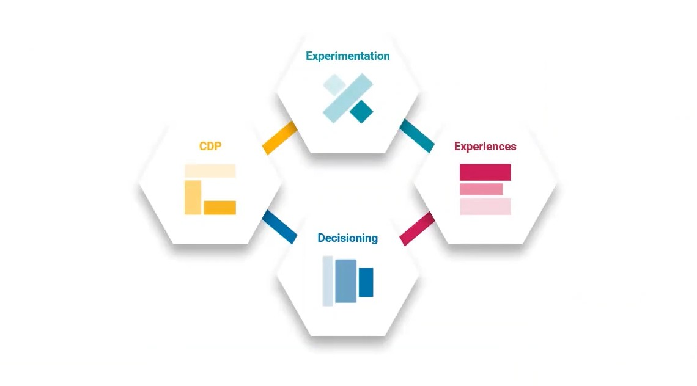{: height="90%"}

_Photo by Sitecore Boxever_
  
To start, let’s have a look at the Customer Data Platform Institute’s definition:
>A Customer Data Platform is packaged software that creates a persistent, unified customer database that is accessible to other systems. <sup>[1](#bibliography)</sup>

Exactly one year ago Sitecore announced that it was acquiring customer data platform Boxever, a step forward in Sitecore SaaS journey. It will lay together with Experience Edge, Content Hub, and four51 on a more ecommerce note. 

Quoting from the release acquisition note:
>CDP provides a 360-degree view of customers, advanced segmentation, real-time decisioning and experimentation that acts as the brain within an organization’s marketing stack to make every customer interaction more relevant and engaging. <sup>[2](#bibliography)</sup>

In this post we will have an overview over the functionalities and implementation kick start.\
PS: don't miss the [FAQ](#faq) at the end.

## The components

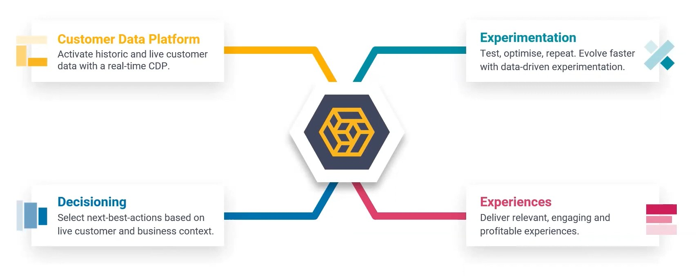{: width="100%"}

Sitecore CDP is able to provide consolidation of customer data with omnichannel personalization experimentation decisioning and next best actions through four main components
* The customer [**data**](#the-data) platform itself
* The [**decisioning**](#the-decisions) engine 
* Delivering [**experiments**](#the-experiments) to the customers  
* Delivering [**experiences**](#the-experiences) such as next best actions to the customers

:bulb: What is important to highlight is that Sitecore CDP is a standalone product, does not depend on any other Sitecore product and therefore can be offered to the Client on top of their current content management solution. Does it integrate with my Sitecore solution? Yes and No, more about this a bit later.

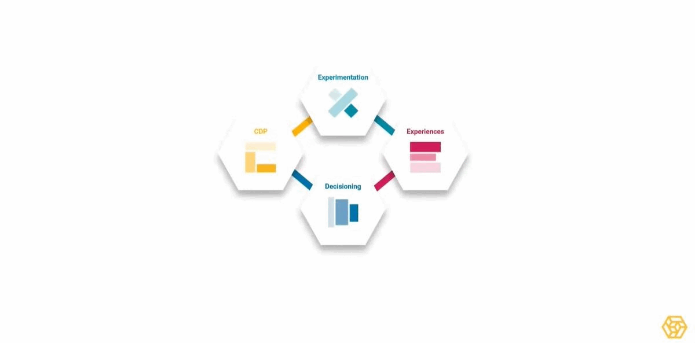{: width="100%"}

These four components are working together so that the Client can take decision based on ingested data and deliver to their customer across all channels.\
Any available system can be part of the source data it being a click Stream, an Interactive system, or a Batch job. The data is ingested and enriched, and any service in the Client organization can be part of the decision making. This include inhouse data from AI tools or training models.\
These decisions are used to deliver Experiences and Experiments (we're getting there) across all the available Client's channels.


## The data
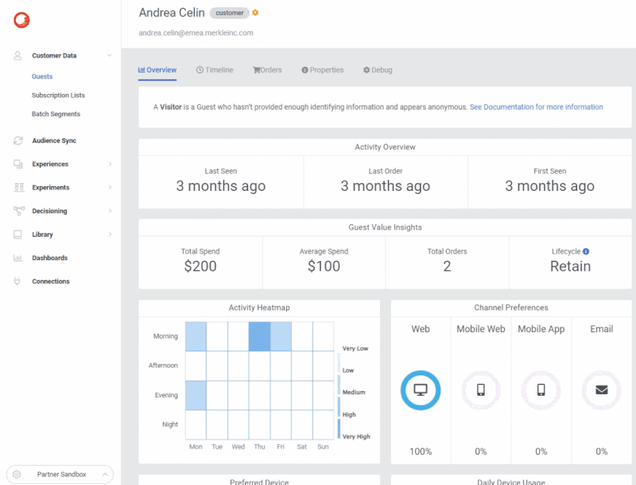{: width="100%"}

Everything starts with consolidating all gathered customer information and real-time customer insights for anonymous and known (*Deterministic Identity*). These insights can extend from analytics to audience segmentation to be actioned.\
The Business can use a dashboard to access to all the Customer details and information that are important for the specific Client, it can be the abandoned cart, or the time spent on a product page, or the time spent reading a news or scrolling through the homepage.\
These information are shown as a timeline of customer events.

## The decisions
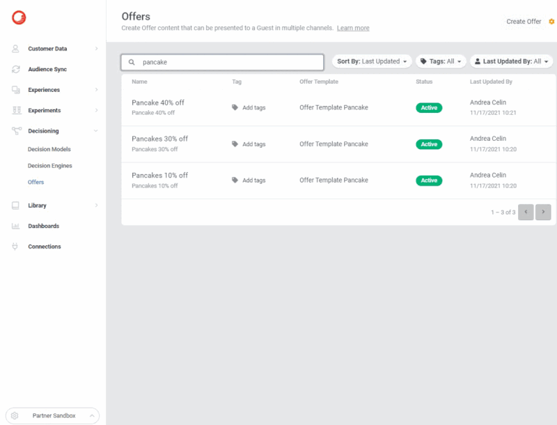{: width="100%"}

The Client can model decisions and next best actions based on customer and system data in real time via the decision canvas, the data can be dragged and dropped into a sequence.\
Also, data originating from other systems can be also used to provide business context, in addition of customer data. For example, product stocks and prices, or other models and AI data sources.\
When the decision flow is set, the decision tables are used to provide a method to easily map data inputs to offers experiences or actions.

## The experiments
{: width="100%"}

Once the decisions are made it's possible to start delivering Experiences.
Experimentation gives the possibility to the Business to create hypothesis and learn through interactions with the customers to reach their goals. They can test these hypotheses on any channel, usually with no IT involvement or to better say with as little as possible (some custom templates may require a little of JS or HTML). A/B testing anyone?

## The experiences
{: width="100%"}

Experiences enable the Business to deliver the best actions and personalization tailored on a single customer, based on its data, business information. The outcome is published consistently across all channels 
and the Business.\
Like to the experiments, the Business can use almost no-code templates to publish variations (same restriction applies, if we use very custom templates).\
Again, as for the Experiments, Experiences will be consistent across all delivery channels anywhere, including progressive profiling banners, alerts, push notifications, and emails.

## The Sitecore CDP offers
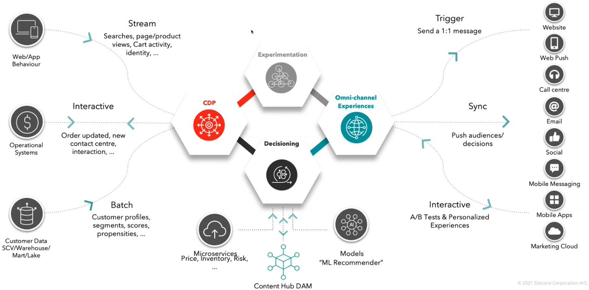{: width="100%"}

Wait, why offer**s**, why is that plural?\
Because Sitecore CDP comes as CDP or as CDP & Personalize.\
So, the components that look to work so well together, are all available **only** when you use CDP + Personalize. I know what you think and yes, I do agree.\
### Sitecore CDP
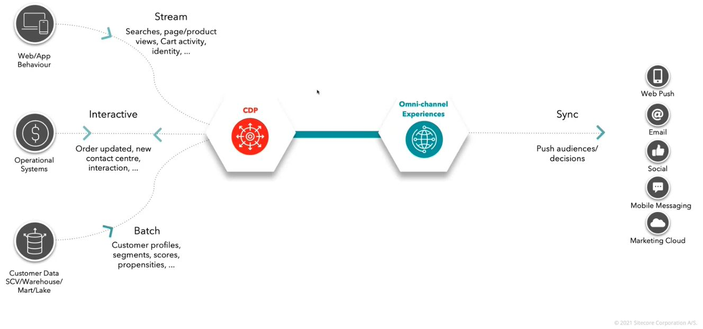{: width="100%"}

This is what you get when you can access only the Sitecore CDP.\
As you can see the Experiments and the Decisions are gone. Yet you have data ingestion, such as REST and Batch jobs.

### Sitecore Personalize
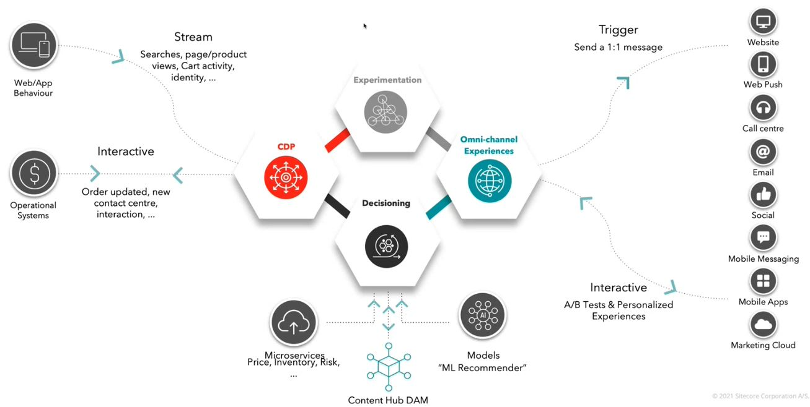{: width="100%"}

As you can see you have whole stack, as described before. With Personalize real-time ingestion is added to the functionalities, altogether with Decisions and Experiments.

## A little example

The scope of this example is to integrate CDP in your website and use some of the CDP and Personalize features.\
Once you gained  access to the portal ([see here](#i-want-it-where-do-i-have-to-sign-question-01)), there are few more things to set be before proceeding.
* Enable the API Access
   * Click on _Partner Sandbox_ > _System Settings_ > _API Access_
   * Set _API Token Active_ to _ON_
   * You will use your Key and Token values
* Enable Debug
   * Click on _Partner Sandbox_ > _Your Name_ > _Feature Flags_
   * Enable _debug_
   * From now on you'll see a little yellow cog on top right, almost everywhere. With debug activated you can inspect the underlying JSON for inspection.

OK. Now we have to create our frist _Point Of Sale_.\
Click on _Partner Sandbox_ > _System Settings_ > _Point Of Sale_ and on top right _Create_.\
A popup will show, and you can give it a name that's meaningful for you.\
:bulb: Have you noticed the little yellow cog on the left? It's the debug previously activated.\
{: width="100%"}

### A bit of coding

We need a sandbox for our testing, we're going to use [Glitch](https://glitch.com). Create a new _Hello World_ website and let's start.

In order to activate CDP we need a JS block that will be placed at the end of the page. There are some configuration values that you'll have to change in accordance with your CDP API and PoS.\
NB: this is intended as an example, and not a best practice guide when it comes to secrets, security, etc.

Open your _index.html_ page in Glitch and paste the following code at the just before closing body tag.

```javascript
<script type="text/javascript">
   // Define the Boxever queue 
   var _boxeverq = _boxeverq || [];
  
   const clientKey = 'REPLACE WITH YOUR CLIENT KEY';
   const libraryVersion = '1.4.8'; // Update version with latest available
   const targetAPI = 'https://api.boxever.com/v1.2'; // Update version with your API target endpoint
   const cookieDoman = 'glitch.com'; // Replace with your website domain or sandbox of preference
   const pointOfSale = 'REPLACE WITH YOUR POINT OF SALE NAME';

   // Define the Boxever settings 
   var _boxever_settings = {
      client_key: clientKey, 
      target: targetAPI, 
      cookie_domain: cookieDoman,
      pointOfSale: pointOfSale,
};
   // Import the Boxever library asynchronously 
   (function() {
      var s = document.createElement('script'); s.type = 'text/javascript'; s.async = true;  
      s.src = 'https://d1mj578wat5n4o.cloudfront.net/boxever-' + libraryVersion + '.min.js';
      var x = document.getElementsByTagName('script')[0]; x.parentNode.insertBefore(s, x);
   })();
</script>
```

Save, run, and inspect: you should have no errors on the browsers console at this point.\
Next step: sending our customer identity as an event. This will create a new Guest in the _Customer Data_ dashobard on CDP.\
Let's add a _Login_ button first, we'll map click event to this to send a pre-made payload. In real case scenario, you'll populate it with real data, and / or decide to send event automatically at load and after login.\
Remember that it's important that we create a browser session for CDP, we can make it ingest a additional data afterwards.

#### Customer Data

##### Data ingestion

For the next code you can decide to add it to the _index.html_ or create a new JS file and reference it.\
We'll add two functions, one is a _base_ function that send any event with any payload to CDP, then our first event function will use it to send and **IDENTITY** event to CDP.\
Feel free to implement as you like, although this is an example, I'm trying to keep down the duplication of code.

```javascript
function sendEvent(event, values) {
   // Place an anonymous function in the Boxever queue
   _boxeverq.push(function() {
   var dataEvent = {
      browser_id: Boxever.getID(),
      channel: "WEB",
      type: event
   };
   // Append our payload data
   dataEvent = Object.assign(values, dataEvent);
   // Invoke event create (<event msg>, <callback function>, <format>)
   Boxever.eventCreate(dataEvent, function(data) {}, "json");
   });
}
```
This is the base function, it accepts an _event_ as a string accepted by CDP, and a payload _values_ that will be send with the event.\
Payload changes depending on the event of course. You might notice the _channel_ property that identify our ingestion channel: WEB in this case.

```javascript
function sendId() {
   // Client data layer as defined by the client e-commerce platform
   var data = {
   currency: "EUR",
   language: "en",
   firstname: "John",
   lastname: "Doe",
   email: "john.doe@amazingcustomer.com",
   page: "/homepage",
   identifiers: [
      {
         provider: "BXLP",
         id: "123456"
      }
   ]
   };

   sendEvent("IDENTITY", data);
}
```
The function defines the payload and use the **IDENTITY** event name to send it via the previous function to CDP.\
If everything went well, after you load the page and click on the _Login_ button, you should see something like this on the CDP _Customer Data_ dashboard.

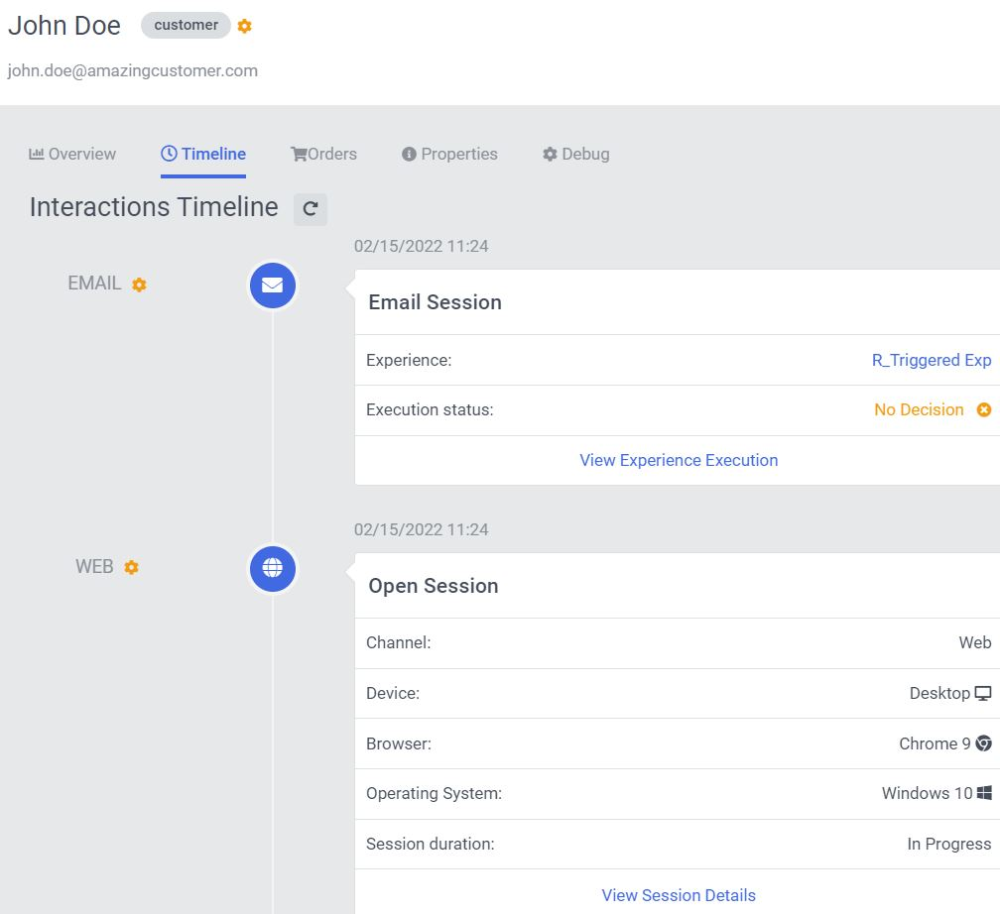{: width="100%"}

Now we have a CDP session and the browser id for the customer.\
:bulb: I suggest you to click on the yellow cog on the right of the _John Doe_ and dig into the JSON debug payload.

### Customer behavior

Let's make our customer to view a product, then add it to the cart,  confirm the checkout, and finally purchase it.\
We need three more buttons and related functions.

Below the function to send a **VIEW** event about the product.\
The valuable part is the _page_ property where we specify which product (or just a page) we want to send.

```javascript
  function sendView() {
    var data = {
      currency: "EUR",
      language: "en",
      page: "/products/backed-potato"
    };

    sendEvent("VIEW", data);
  }
```

Below the function to send a **ADD** event about the product.\
The payload here is more complex. It's mostly an example so all the data you should get from the running ecommerce platform. Refer to the documentation for the meaning and use of all the [technical properties](https://doc.sitecore.com/cdp/en/developers/sitecore-customer-data-platform--data-model-2-1/send-an-add-event-to-sitecore-cdp.html).

```javascript
function sendAdd() {
  var data = {
    currency: "EUR",
    language: "EN",
    page: "/products/backed-potato",
    pos: "potato_factory",
    product: {
      type: "POTATO",
      item_id: "BACKEDPOTATO_90",
      name: "Backed Potato of Excellence",
      orderedAt: getTimeStamp(),
      quantity: 1,
      price: 100.0,
      productId: "BACKEDPOTATO0001",
      currencyCode: "EUR",
      originalPrice: 100.0,
      originalCurrencyCode: "EUR",
      referenceId: "BPEX_001-1"
    }
  };
  
  sendEvent("ADD", data);
}
```

Below the function to send a **CONFIRM** event about the product(s) added to the cart.\
Confirm event captures the confirmation of purchased products. It is a vector of the products that are confirmed to be in the cart before the payment is made.\
The payload here is a simpler version of the payload, containing only the needed information to confirm the cart status.

```javascript
function sendConfirm() {
    var data = {
      currency: "EUR",
      language: "en",
      page: "/confirm",
      pos: "potato_factory",
      product: [
        {
          item_id: "BACKEDPOTATO_90"
        }
      ]
    };
    sendEvent("CONFIRM", data);
  }
```
    
Below the function to send a **PURCHASED** event finalizing the purchase.\
Confirm event captures the confirmation of purchased products. It is a vector of the products that are confirmed to be in the cart before the payment is made.\
The payload here is a simpler version of the payload, containing only the needed information to confirm the cart status.
    
```javascript
function sendCheckout() {
  var dataCheckout = {
      language: "EN",
      currency: "EUR",
      page: "/checkout",
      pos: "potato_factory",
      reference_id: "BPEX_001-1",
      status: "PURCHASED"
    };
    sendEvent("CHECKOUT", dataCheckout);
}
```
On the _Customer Data_ > _Guests_ > _Your User_ dashboard, brose to _Debug_ and expand the _Events_ to see the list of events.\
In this case, bottom up, you see the customer initiating a session, then adding the product, confirming, and purchasing at the end.

{: width="100%"}

As you can see it is reflected as well in the orders tab, where you can have detail about the transaction.

{: width="100%"}


### Experiment

Let's introduce Web Experiments (variants: A/B testing) to see some more concrete on the website side.\
We'll use the Experiments to create a variant where we'll show a popup to ask for feedback. We'll measure that the Experiment performance with a Goal.\
Meanwhile we'll use some custom template that will involve some _coding_, usually The amount of coding will be minimal, and this is one of the strong points brought by Sitecore, where the Business can create Experiments and Experiences without the help of the IT.

On the portal from the left side menu _Experiments_ > _Web_ and click on the top right button to _Create_ a new Experiment, give it a meaningful name.

{: width="100%"}

Add a new Variant, you'll be asked to select a template. On the list search for _Corner Popup_ and select the _Out of the box_ one. From then, we'll personalize.

It's possible to customize the basic property of the template and to customize it deeper, to create a template that fits the current need and future reuse.\
We're adding some additional fields to accommodate the use we're doing here: a star feedback system.\
On the fields pane customize the title, maybe add an image.\
Then scroll down and click the link _Advanced Edit_, this will open a new page with different tabs where you can customize HTML, JS, CSS, and API (we'll not use API for this example).\
Copy paste the following HTML in the HTML tab, and the JS further below on the JavaScript tab.

The HTML below creates five new fields, one per each feedback start, that the business can use to give a custom value for future uses.\
This fields are bound to a click via the JS snippet, that will fire new events to CDP.
```xml
<!-- Use dynamic Guest variables, type ctrl+space or guest to explore available entities.-->
<link rel="stylesheet" href="https://cdnjs.cloudflare.com/ajax/libs/font-awesome/4.7.0/css/font-awesome.min.css">
<!-- Type "d" to see decisioning helpers -->
<div id="bx-transition-card">
    <div class="img-container">
        <div class="img-container__image"></div>
    </div>
    <div class="bx-transition-card__body">
        <h3>[[Title | string | Title | {required:true, group: Title, order: 1}]]</h3>
        <p>[[Description | text | Lorem ipsum dolor sit amet, consectetur adipiscing elit, sed do eiusmod tempor incididunt | {required:true, group: Description, order: 1}]]</p>
        <div class="options-container">
            <div id="bx-transition-card--star" class="options-container__star fa fa-star" data-feedback="[[One | number | 1 | {required:true, group: Star Buttons, order: 1}]]"></div>
            <div id="bx-transition-card--star" class="options-container__star fa fa-star" data-feedback="[[Two | number | 2 | {required:true, group: Star Buttons, order: 2}]]"></div>
            <div id="bx-transition-card--star" class="options-container__star fa fa-star" data-feedback="[[Three | number | 3 | {required:true, group: Star Buttons, order: 3}]]"></div>
            <div id="bx-transition-card--star" class="options-container__star fa fa-star" data-feedback="[[Four | number | 4 | {required:true, group: Star Buttons, order: 4}]]"></div>
            <div id="bx-transition-card--star" class="options-container__star fa fa-star" data-feedback="[[Five | number | 5 | {required:true, group: Star Buttons, order: 5}]]"></div>
            
            <a id="bx-transition-card--close" class="options-container__close">[[Close Text | string | No thanks | {required:true, group: Close Button, order: 1}]]</a>
        </div>
    </div>
</div>
```

Check on the comment section to see how each star item is bound to a click event and it will trigger a custom event to be sent to CDP.

```javascript
// Adds a unique variant identifier to CSS when deployed to ensure CSS does not impact styling of other elements.
var compiledCSS = Boxever.templating.compile(variant.assets.css)(variant);
var styleTag = document.getElementById('style-' + variant.ref);
if (styleTag) {
    styleTag.innerHTML = compiledCSS;
}
// End Adds a unique variant identifier to CSS when deployed to ensure CSS does not impact styling of other elements.

// make space in the body for the experience
insertHTMLAfter("body");
var bxContent = document.querySelector("#bx-"+variant.ref+ " #bx-transition-card");

setTimeout(function() {
    bxContent.classList.add("open");
    sendInteractionToBoxever("VIEWED", 0);
});

var bxCardClose = document.body.querySelector("#bx-"+variant.ref+ " #bx-transition-card--close");
bxCardClose.onclick = function() {
    sendInteractionToBoxever("DISMISSED", -1);
    bxContent.classList.remove("open");
}

// Here we handle the clicks on the feedback start and send the custom event
var btxCardStars = document.getElementsByClassName("options-container__star");
Array.from(btxCardStars).forEach(function(btxCardStar) {
  btxCardStar.addEventListener('click', function(btxCardStar) {
        var feedbackValue = event.target.getAttribute("data-feedback");
        sendInteractionToBoxever("FEEDBACK", feedbackValue);
        window.location.href = "[[Star destination URL | string || {required:true, group: Star Buttons}]]";
    });
});
    
function sendInteractionToBoxever(interactionType, feedbackValue) {
    var eventToSent = {
        "channel": "WEB",
        "type": "[[ Experience ID | String | CORNER_POPUP | {required: true}]]_INTERACTION",
        "pos": window._boxever_settings.pointOfSale,
        "browser_id": Boxever.getID(),
        "interactionID":"BX_CORNER_POPUP",
        "interactionType": interactionType,
        "ext": {
            "feedback": feedbackValue
        }
    };
    Boxever.eventCreate(eventToSent, function (data) { }, 'json');
}
// Here ends our custom feedback event
```

At the end of the changes, this is something it should looks like.

{: width="100%"}

Next step is to define the page targeting. This set the rules for showing our Experiment, not the variants. This means that if the page targeting rules are not met, the A/B will not event start.\
Important is to define the domain for which the Experiment will run, otherwise in case of multiple sites or domains, there's the possibility it will appear.\
Click on _Add_ and on page targeting make sure that the _Contains_ matches with your website FQDN (for example for Glitch, something like this: chalk-ginger-jet.glitch.me).\
Is it also possible to add custom JS rules. For example, click _Add_ on _Advanced targeting_ and use this JS. It will add a timeout for the popup to appear.

```javascript
(function () {
    window.setTimeout(targetingPassed, 2000);
})();
```

Finally, let set a Goal.\
Click on _Add_ on the side of _Goals_ and create a new _Custom Goal_.\
Give the Goal a name, for example _Feedback_, a description, and as _Match condition_ set to be _Equals_ to _FEEDBACK_.\
The _FEEDBACK_ matches the event type we're sending with the click on the stars.

We are ready to start!\
First of all we can test it via _Preview_ on the top right side. Click on it, add your website domain and check the preview.\
Before clicking _Start_ and let the data flow, you can fine tune the amount of traffic to which this Experiment will run against, as well as the amount of traffic for each variant.\
For example, setting 80% for the Experiment and 50% / 50% between _Original_ and your _Variant_ will direct 40% to the variant.

After a while some time you'll collect data from the Experiment, here below and example of the _Report_ you can find in the Experiment dashboard.

{: width="100%"}

#### The take

This little example, also covered by the official training, shows a little of the wider possibilites that Experiment can offer. The out-of-the-box templates are a good starting point but surely everybody can implement more for customized and wider range of utilizations.\
The possibility to attach a Decision engine, targeting, multiple variants different segmentations really open a world of possibilities for the Business, this without a Sitecore infrastructure just on top of the Client current content management system, doesn't matter if top notch brand, a simple jamstack static website, or any other channel of choice.\
Did it spark any idea you can develop for you Client?

### Experience

So, what's that again between Experiment and Experience (see [FAQ](#experiments-experiences-im-confused-question-07)) that sounds bit confusing.\
First of all as you can see [here](#the-sitecore-cdp-offers) Experiences and Experiments are not always available, unless your choice is Sitecore Personalize and not only Sitecore CDP.\
Secondly Experiment stay at A/B testing as Experience is at Personalization.
Just as per Experiment, also the Experience allows a _Full Stack_ implementation (more [here](#why-theres-a-web-and-a-full-stack-option)) giving you a wider utilization scope.\
For our example we'll implement a personalization that, given a customer parameter, will provide a specific personalization.

### Offer-ing

Let's start our journey with the _Decisioning_ part.\
We create four _Offers_ for our customers, as you can see from the naming (offers) CDP is very commerce oriented, however nothing stops you to use it for your needs thanks to the _Offer Template_ that allows you to create ad-hoc model. Maybe in the future they will change the name to a more generic one.

With the portal open click on the side menu _Library__ > _Offer Templates_ > _Create Offer Template_ (top right) to create our first offer template.\
We want to give some additional _Attributes_ to our Offer that we'll use later, in the Experience flow.

Below an example of our template, to offer different types of products. Again, it can be anything you need, thanks to _Attributes_.\
On the _Context_ you can specify a context type that can be used with _FreeMarker_ snippets in the offer (more about it later).

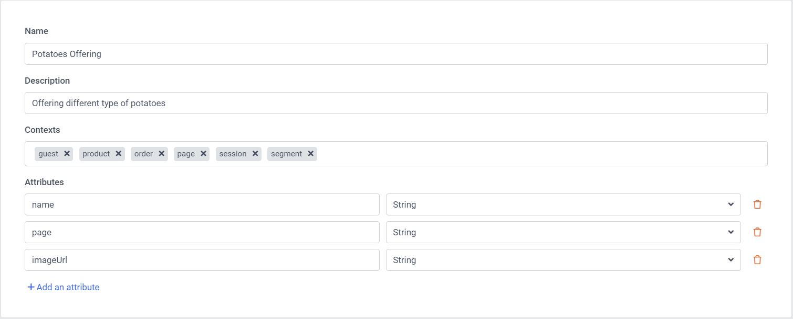{: width="100%"}

Now that we have our template let's click on the side menu _Decisioning_ > _Offers_ > _Create Offer_ (top right) to create our bunch of offers based on the template we've just created.

On the offer below you can see highlighted we used one of the _Context_ parameters in the Attribute value. For example, I've used an UTM Source with the current utm_source, it's just a click and select from the icons on the right side of the attribute.\
Of course, it's only an example and there are better real life configurations you can write.

{: width="49%"} 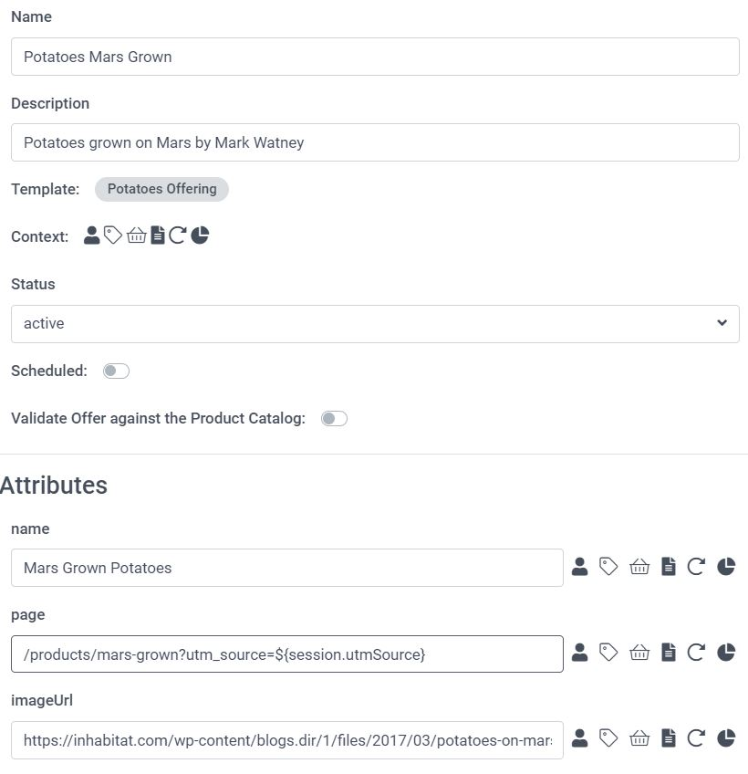{: width="49%"}

### Decisioning

We are our offer template and offers, now we can build up a decision model to set rules that will select which of our offer to be returned to our customers.\
CDP provides a visual editor and scripting tools, although quite little code is required, it might be not so easy for the Business to handle them.\
_Decision Model_ allows you to have different variants of your decision table (rules) and different environment where to test them (Draft, Test, Production), and of course local online testing.\
Let's create our first variant for a decision table.

Click on the side menu _Decisioning_ > _Decision Models_ > _Add Variant_ (on the Draft environment) to create our first Variant, give it a meaningful name for the scope: for example _V1.0_ to keep track of your progress.\
Click on it and the visual editor will appear. On your right side you see many blocks divided by _Input_, _Decisions_, _Sources_, and _External_.\
As you can imagine for recurrent flow you can create a _Decision Template_ to reuse in this editor, rather than write code every time. As well for complex decision you can leverage on _External System_ for business rules, or AI.

For our basic decision-table flow to work we'll need at two inputs:
* _Guest_ block
* _Offers_ block
As you can imagine those blocks bring in the flow the customer data (as much data as CDP collected and merged), and the offers we have created before.

Now we need to add a _Programmable_ to build a payload based on the input _Guest_ and a _Decision Table_ where we'll compose our rules with all the inputs.

This is what will look like at the end:

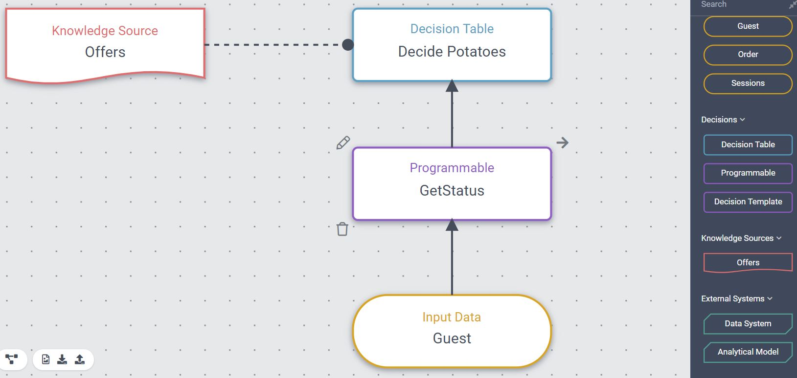{: width="100%"}

Let's dig down on _GetStatus_ where we build our payload (and not only), and on the _Decision Table_ where the rules are assembled.\
For the programmable we build a JS object with two properties out of the Guest data.\
The object _guest_ is returned by the platform, you have the possibility to expand and explore the customer data on the editor and pick the values you want.\
This is a basic example but the possibilities range widely, including custom data collected for the customer earlier.\
You can see the code here below.

```javascript
(function () {
  return {
      "TopBuyer": guest.orders && guest.orders.length > 1, 
      "HasOrders": guest.orders && guest.orders.length !== 0
  }
})();
```

Recap: _Guest_ input > _Programmable_ to process the data > _Decision Table_ for the rules.\
Let's dig in it.

I've circled the inputs. You can get inputs from various sources, including the Guest data, JS, and our Programmable block.\
This part has changed during last months and I believe that will mature even more and undergo little changes in the future.\
So, we've selected our input starting from the programmable JS object output: _Status_.\
Then we add an Output, in our case we want to use our Offers.\
The main objective is to add the rules indeed. Let's create three rules based on our customer status. The three rule here are simply based on the spending level I've guessed for the guest; I'll propose more and more expensive related products. Again, this is a simple example.

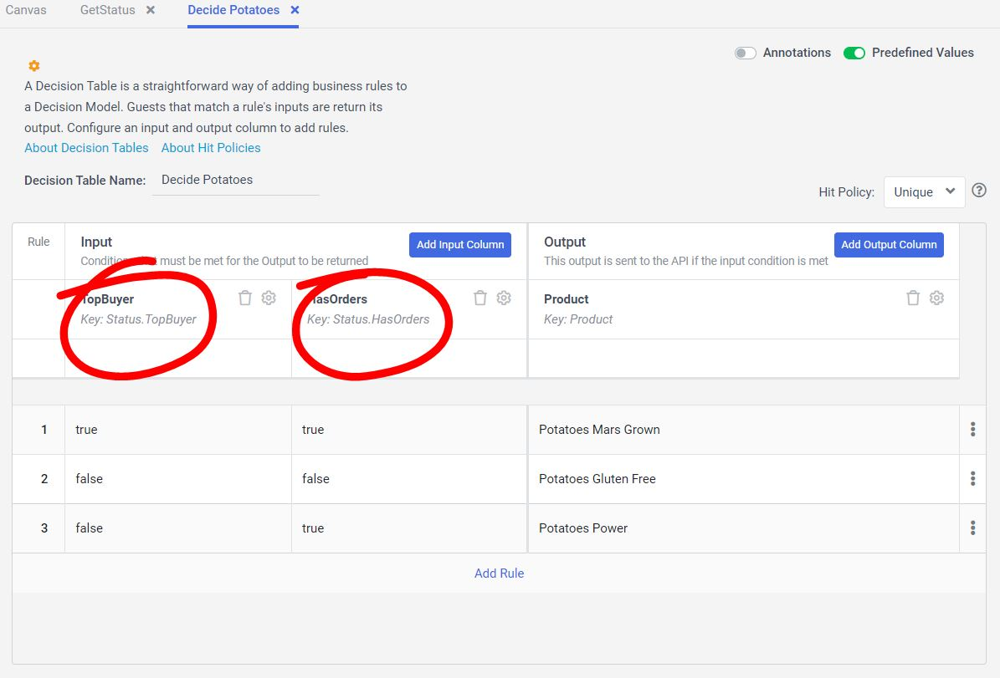{: width="100%"}

Now we are ready to test the _Canvas_ even before bringing it to the _Test_ environment. Click on _Test Canvas_ top right and select a customer to test the rule against it. If everything went fine, you'll see the offer that's the result of the whole flow.\
My test returns the most expensive product because I'm a loyal customer and have a lot of orders done.\
Back to environments block, move it to _Test_ and then do all your test before moving on _Production_, once there it will not be editable anymore and you'll have to create a new Variant.\
Now that's in _Production_ it is available to be used on the _Experiences_.

{: width="100%"}

### Experiencing

CDP offers two ways to implement _Full Stack_ personalization:
* Interactive personalize using APIs to serve dynamic data on inbound channels such as your website.
* Trigger an Experience on outbound channels when there's a change to data or when an event is sent. Common use-cases are emails, SMS and push notifications.

We'll address _Interactive_ at first.\
From left side menu click on _Experiences_ > _Full Stack_ > _Create Experience_ (top right) > _Interactive Experience_, and give a name to it.\
:bulb: Take note of your Experience ID when you give it a name.

Time add some _FreeMarker_ (we anticipated it [here](#offer-ing)) code to your experience. It's the matter of creating a new JSON object that will be our result payload on the channels of choice.\
Let see an example for our case:

```javascript
{
    "title": "${guest.title!""}",
    "firstName": "${guest.firstName!""}",
    "lastName": "${guest.lastName!""}",
     <#if (offers)??>
    "decisionOffers": ${toJSON(offers)}
    </#if>
}
```
As you can see it includes some _FreeMarker_ code, the #if parts that help to build JSON in case our Decisioning returned some offers for the customer.\
Let's not test it yet, we neeed the decisioning yet.

Next step add your _Decisioning_ to the Experience. Just on the decisioning block click _Add_ and search your decisioning by its name. Done, easy!

Now we can test it. Go back to the Personalization code and click on _Preview API_. Select a customer and send the request. In the _Experience Response_ you should see the JSON you just build with the offers included (or none if the customer is not.. good enough).

### Full stack

We choose full stack because we needed this personalization for a mobile App for example not exclusively for the website, although it's yet possible to call this Experience via the JS library just like we did for the [customer behavior](#customer-behaviour).

[**PostMan**](https://www.postman.com/downloads/) will be our tool to pretend our channel call.\
To do so we need few things: 
* Be sure we Started our Experience via dashboard
* An endpoint to call
* A properly valued payload

The endpoint to call is **https://api.boxever.com/v2/callFlows**\
The payload has few values, all originating from your Point of Sale and your Experience.

In this case I pretended to be myself as a customer, I'm using the Experience friendly name (remember, when you created it to save it).

```JSON
{
    "channel": "WEB",
    "language": "EN",
    "currencyCode": "EUR",
    "pointOfSale": "potato_factory",
    "email": "andrea.celin@emea.merkleinc.com",
    "clientKey": "{{apiId}}",
    "friendlyId": "potatoes_offering"
}
```

The result of such call is the JSON that shows what personalization I shall have, up to the developer to decide how to use it in the channel.\
You see all the properties we defined at the very start, on the _Offer Template_ are here!\
Here the result:

```JSON
{
    "title": "",
    "firstName": "Andrea",
    "lastName": "Celin",
    "decisionOffers": [
        {
            "ref": "2514a61c-33a3-4737-aa64-364c674a8b55",
            "name": "Potatoes Mars Grown",
            "description": "Potatoes grown on Mars by Mark Watney",
            "status": "ACTIVE",
            "attributes": {
                "name": "Mars Grown Potatoes",
                "page": "/products/mars-grown?utm_source=${session.utmSource}",
                "imageUrl": "https://inhabitat.com/wp-content/blogs.dir/1/files/2017/03/potatoes-on-mars-1-600x480.jpg"
            }
        }
    ]
}
```
\- _What if I want something more than just offers?_\
\- Let's make it a little bit more interesting!

By the time being CDP is quite rigid in some aspects, for example: Offers. However, it has the means to compensate it. What is needed is a bit of effort and understanding some not-so-upfront concepts.

Let say we want to return some additional items as well that for a reason or another is not possible to _transform_ into an Offer, or because maybe we want to cherry pick them based on some condition.\
This is exactly our case, so first of all we'll need a new data source that will provide our data.\
I'm opted for a static data source: [XANO](http://xano.com/) with the FREE tier allows you to quickly create a little DB that you can cosume with REST API. Very handy!

I've created a REST API that accepts a parameter _IsVIP_ and return a list of products for VIP customers. You can use the one I've created, until it expires, [here](https://x8ki-letl-twmt.n7.xano.io/api:lhHqphtC/products/true).

Now we have a GET REST API, let's create a _Connection_ in CDP.\
From the left side bar click _Connections_ > _Add Connection_ > _Data System_\
As you can see we choose Data System for external data, however for different applications we have also _AI_ and _Destination_ output connection at our disposal. This might be a topic for another blog post.

Choose a name and an icon, give a description, and no authentication for our endpoint. At request past the API Url and set the URL parameter as _${isvip}_.\
See below

{: width="100%"}

Let's continue to the mapping part. Let the input parameter to _isvip_ and disable the _message_ output. We'll just need the results.

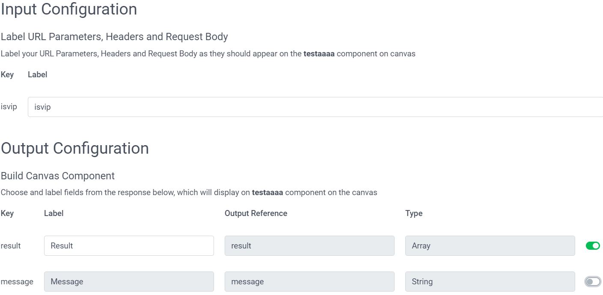{: width="100%"}

Now we have our data source we can use in different scenarios. However we want to add this products based on the _Decision Model_ within our _Experience_ response.\

**Step one** - add the data to the _Decision Model_\
Open your previously created _Decision Model_ and create a new _Variant_ since the one in _Production_ is not editable anymore. You will be asked if to start from a scratch or base on the previous one. Let's base it, we just need to make some changes.\
From the right hand pane, add _Data Systems_ to the canvas, select your previously created _Connection_, we ready.\
:bulb: Generically it's enough to drag and configure the _Data Systems_ into the canvas to make the data available in the decision output. No need for linking blocks, it  might sound counter intuitive but that's all is needed if you just want the data as is.

However we want to make things little more diff..interesting.\
**Step two** - get specific _Data Systems_ data
We don't just want data as is, but based on the decision taken by the _Decision Model_.\
To do that we need to add an _Output_ column to the table that will return a static value that we will pass to the _Data Systems_ and therefore to the underlying _Connection_ and REST API.\
:bulb: CDP show to be a little quirky, wasting a bit of my time here. Although the _IsVIP_ should be of a _Boolean_ type, the _Connection_ refused to take it and accepted only a _String_ type.

Here the changes both to the _Decision table_ and to the _Data Systems_:

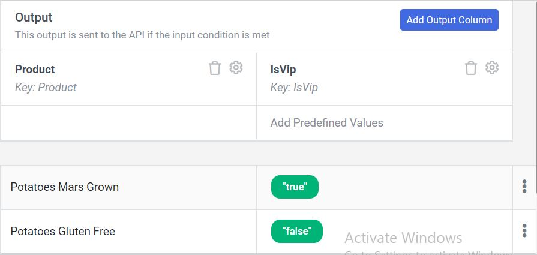{: width="49%"}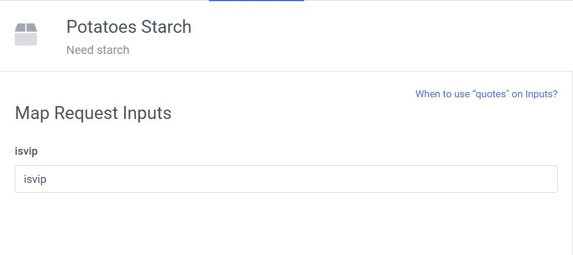{: width="49%"}

This is what the canvas will look like at the end of our changes:

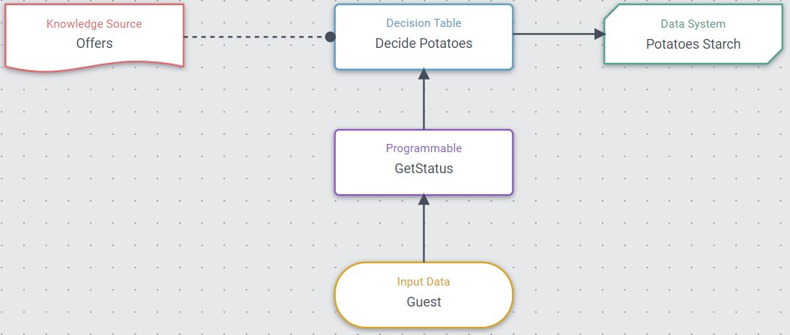{: width="49%"}

**Third Step**

Now we have our payload in the decision model response. We need to _extract_ it and make it public via the _Experience_ API.\
Let's change the code in the _Experience_, if you see you can't change the code is because the personalization should not be running meanwhile, so put it on pause and continue with the changes.\
Here below the changes I've done, let's go row by row.

First line is a _FreeMarker_ snippet provided by CDP itself, when you browse the tabs on the right hand you see _Snippets_.\
There are **extremely useful** snippets and methods that allow you to save a lot of time dealing with JS and JSON.\
In this case we use the snippet that get the node by name, from the _Decision Model_, exactly what we needed!\
Note that we use plain name of the _Data Systems_ block.

Next _FreeMarker_ change is an IF statement to check if the node has an output, then we start composing our array with a sort of _foreach_ in the result collection.\
:bulb: Both _potatoesStartch_ and the _nodes_ are available to be expanded on the right hand, helping you to see the whole payload and find what you want. As well _potatoesStarch.result_ was shown in the _Data Systems_ block by the canvas.


```javascript
<#assign starches = getDecisionModelResultNode("Potatoes Starch")>
{
    "title": "${guest.title!""}",
    "firstName": "${guest.firstName!""}",
    "lastName": "${guest.lastName!""}",
    <#if (starches.outputs?has_content)>
    "starches": [
        <#list starches.outputs[0].potatoesStarch.result as results>
        {
            "name": "${results.name}",
            "friendlyName": "${results.friendlyName}",
            "imageUrl": "${results.imageUrl}"
        }<#sep>,</#sep>
        </#list>
    ],
    </#if>
     <#if (offers)??>
    "decisionOffers": ${toJSON(offers)}
    </#if>    
}
```

Time to move to test with a preview or go on **PostMan** and check our results:\
Here we have the usual JSON, plus the _starches_ array with the data we consumed from the API. Hurrah!

```JSON
{
  "title": "",
  "firstName": "Andrea",
  "lastName": "Celin",
  "starches": [
    {
      "name": "Potato Mars Grown",
      "friendlyName": "mars-grown",
      "imageUrl": "https://inhabitat.com/wp-content/blogs.dir/1/files/2017/03/potatoes-on-mars-1-600x480.jpg"
    },
    {
      "name": "Potato Power",
      "friendlyName": "power",
      "imageUrl": "https://ychef.files.bbci.co.uk/976x549/p01lfnn2.jpg"
    }
  ],
  "decisionOffers": [
    {
      "ref": "2514a61c-33a3-4737-aa64-364c674a8b55",
      "name": "Potatoes Mars Grown",
      "description": "Potatoes grown on Mars by Mark Watney",
      "status": "ACTIVE",
      "attributes": {
        "name": "Mars Grown Potatoes",
        "page": "/products/mars-grown?utm_source=${session.utmSource}",
        "imageUrl": "https://inhabitat.com/wp-content/blogs.dir/1/files/2017/03/potatoes-on-mars-1-600x480.jpg"
      }
    }
  ]
}
```

We added external data to our decision table, we could as well as for help of an AI system to take the decision instead. In that case the _Decision Table_ input column would have been changed, or the _Programmable_ part if more processing might be needed.\
Maybe leave it for another time.

## Summary
On this first overview we addressed the Sitecore offer, Data Ingestion, and Web Experiment, Full Stack Experience.\
Naturally this being an overview doesn't cover all the aspects and possibilities that the platform offers, but it might be enough to get you curious and willing to give a more deep look at it.\
In the next post we'll go through Decision and Experiences, stay tuned.


## Resources
* [This blog examples - search for 'Potato' on CDP](https://app.boxever.com/#/)
* [This blog post source code](../files/2022/02/12/CDP-Project-Part-01.zip)
* [Developer and Business documentation](https://doc.sitecore.com/cdp/)
* [CDP Knowledge Hub](https://sitecore.cdpknowledgehub.com/docs)
* [Configuration templates](https://github.com/boxever/configurations)
* [Boxever training](https://learning.sitecore.com/pathway/boxever-training)
* [CDP and Personalize Certification](https://learning.sitecore.com/exam/study-guide-sitecore-cdp-and-personalize-certification-exam)

## Bibliography
\[1\] - [CDP Institute](https://www.cdpinstitute.org/cdp-basics)\
\[2\] - [Sitecore News](https://www.sitecore.com/company/news-events/press-releases/2021/03/sitecore-acquires-boxever-and-four51)


## FAQ
### I want it! Where do I have to sign? {#question-01}
>Start from [here](https://app.boxever.com/).\
If you have a Partner accout, you can access the Sandbox. Activation might be required.

### Is there any integration with Sitecore ecosystem? {#question-02}
>Yes and No by the time being. It's possible via data ingestion, syncronization (export), API.\
With that regard I will plan for another post in the future.

### Is this tracking cookie base or is it cookieless? {#question-03}
>It's cookie based. What happens is and that session is assigned a browser ID and that's set up in our system. It's used to send in and details session details or events or whatever else.

### Is there a plan to change it to avoid using cookies in the future? {#question-04}
>Yes, there is an interesting article about that, so a lot of the current discussion around cookies. However in this case is mostly a 1st party cookie since it's the Client organization capturing data about their own customers.

### Can a customer browse on different devices and have different IDs? {#question-05}
>Yes indeed, but the CDP takes care to merge them once it find out that other identifications, the email for example, are the same.

### Experiments, Experiences... I'm confused {#question-08}
>Let put it this way:
* Experiments : A/B testing
* Experiences : Personalization

### Can I use Decision with A/B testing (Experiment)? {#question-06}
>Yes, decision works as a rule manager. For example you can use Decision to change what to show to different audience _segments_ without excluding anyone. Let's imagine that certain customer are more prone to respond to your Feedback variant if the text is slightly different. With Decision you can set those rules.

### Can I connect to external data service to consume it on the Experiences? {#question-07}
>Absolutely yes. You can create a new decision model variant that builds on the existing decision model to add a connection to the data system and then return the products that are valid from the decision model and from the full stack interactive experience.

### Why there's a _Web_ and a _Full Stack_  option? {#question-09}
>_Full Stack_ is not specific to a channel, like it creating an endpoint that a mobile App can call.


<!-- FAQ collapsible script -->
<script src="//ajax.googleapis.com/ajax/libs/jquery/1/jquery.min.js"></script>
<script>
   $(document).ready(function(){
   $('.post-content h3[id*="question"]').css('cursor','pointer');
   $('.post-content h3[id*="question"]').nextUntil("h3").slideToggle();
   $('.post-content h3[id*="question"]').click(function() {$(this).nextUntil('h3').slideToggle();});
   });
</script>


