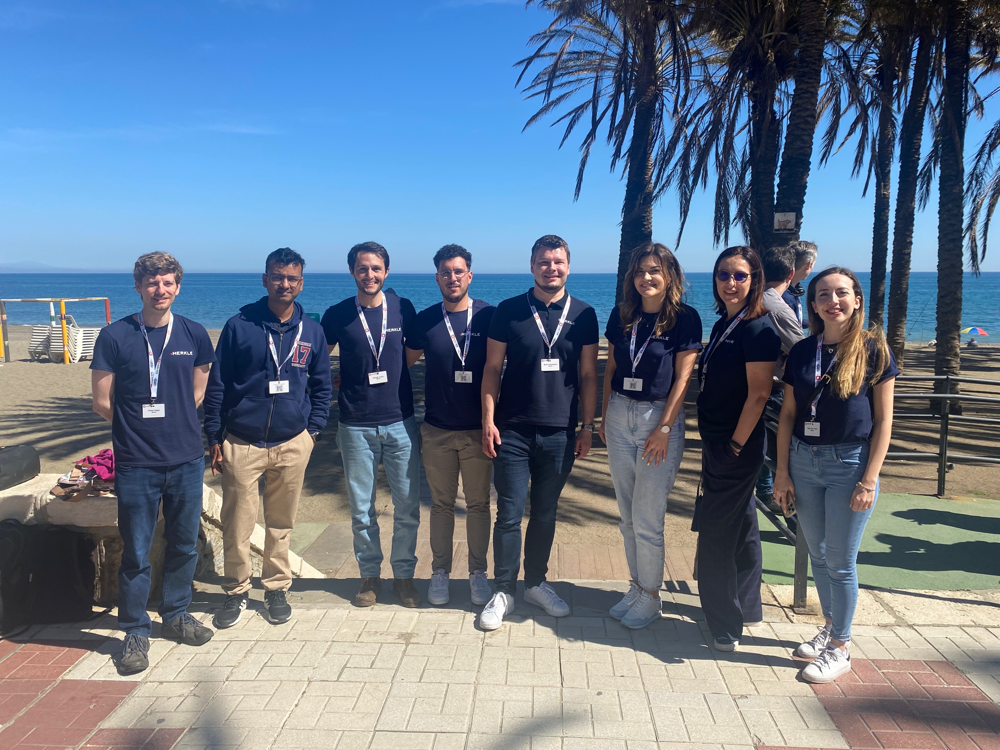
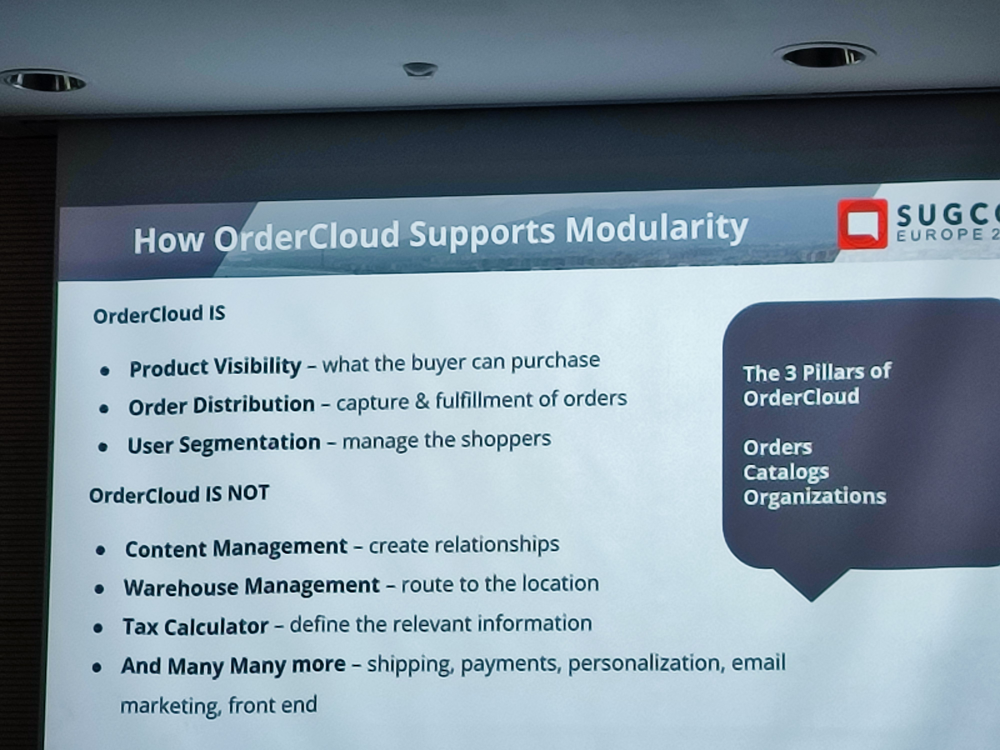
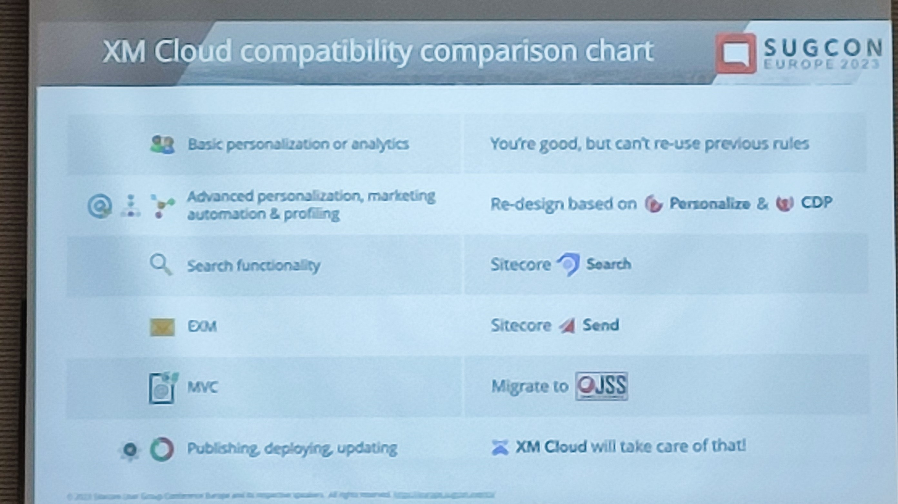
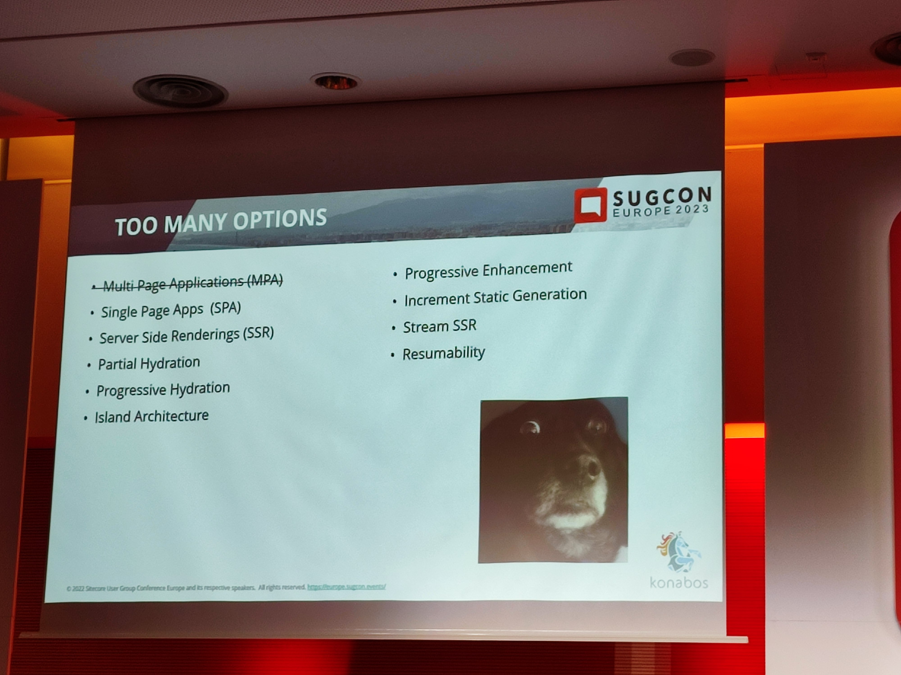
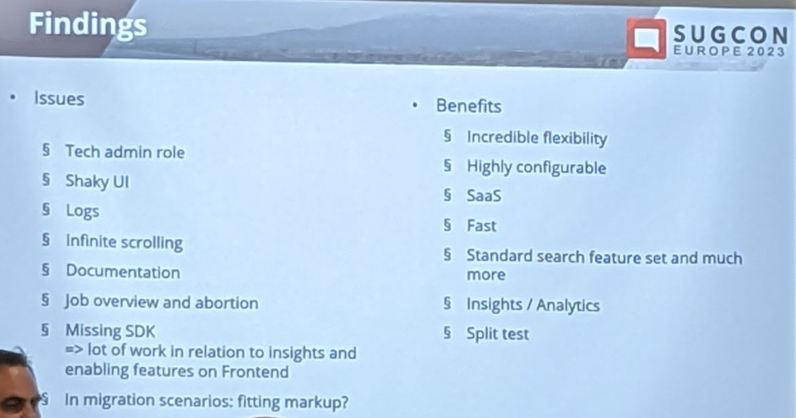
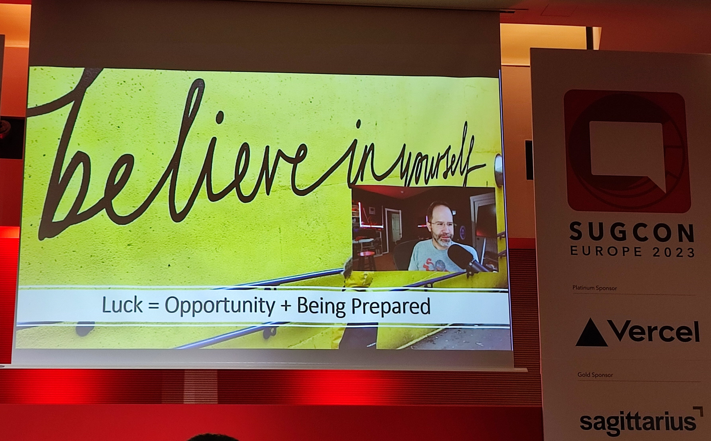

## Our highlights from SUGCON 2023

Only a year after the successful event in Budapest, SUGCON Europe 2023, the European User Conference of Sitecore, was held in one of the world’s oldest cities: Malaga in Spain. Within the magnificent Convention Center, found around Meliá Costa del Sol, two days were packed with lots of sessions about all current topics around Sitecore. 

This was the 8th User Group Conference in Europe and we are so happy we were able to meet the Sitecore Community again in real life.

Sessions included community speakers and members of the Sitecore product and development teams. The goal of the conference was to share knowledge through the whole community, which includes beginner and advanced-level topics and presentations. The one-and-a-half-day agenda might seem exhausting as it was packed and tight, but it was worth it!

Total of eight members of Merkle's Sitecore Squad from four different countries boarded planes to Malaga, joining 300 other Sitecore MVPs and experts. These are <b>our highlights</b> from the event.

# DAY ONE
Day one started with Key Note by Sitecore's Chief Product Officer Dave O'Flanagan and a video-call greetings from Sitecore's CEO, Steve Tzikakis. It was nice to hear Steve's visionary approach as he leads Sitecore to greater heights. We are super thankful to Dave for joining us in person for the second year in a raw to provide an update on the company's product strategy and for highlighting key focus for the next year! It was interesting to hear his speech on how it's not enough to have great products, but also how important it is to promote them and put them on the market.

## Life at the Edge with Vercel and Next.js
The opening presentation from the main sponsors of the event was a solid insight on how this stack allows developers to create dynamic web experiences at scale and instantly deploy them to a fully-managed, auto-scaling Global Edge Network. Javi Velasco showed us how Vercel and Next.js are helping developers create faster, more personalized, and more reliable web experiences. 
___
Once the separate sessions started, our team tried to split in a way we would cover most of the presentations. Here's what we collected.
___

## Innovations in Deploy
Andy Cohen introduced deploys on XM Cloud. All new available things are shown, such as environment variables (no integrations with KeyVault or any of the like, yet). It was shown that now, when triggering a deploy, the CM and the RH are separated, so if you only change one, you'll only deploy one. There is also a tab where you can check all your environments, current code source, and option to promote branches. Nice.

## Accelerate website builds with Headless SXA and XM Cloud
Special kudos go to presentation by Martin Miles. There is a [blog post](https://blog.martinmiles.net/post/ultimate-guide-to-XM-Cloud) which completely covers the presentation and is a great starting point to XM Cloud. We highly recommend it!

## Composable Strategies for OrderCloud
The message we took home from the presentation by Steven Davis was: Only use OrderCloud for what is supposed to do. You should not try to customize to add additional functionality like Tax calculation or similar.

## Connecting Customer Experience: Why Composability is Key to Integrated CX session
One of the highlights from the first day was the session by Daniel Delay. He started the presentation by explaining the challenges that Digital Marketers face today (so many channels, so many technologies with so many different responsibilities) and gave an overview on how Sitecore marketing products evolved over time

* Sitecore OMS → Online Marketing Suite
* Sitecore DMS → Digital Marketing System
* Sitecore xDB → Sitecore Experience Database
* Sitecore XP → Sitecore Experience Platform

After showcasing the evolution of Sitecore marketing products, an overview about Sitecore new cloud products was given:

* Content Cloud → XM Cloud, Search, Content Hub Operations, Content Hub DAM and Content Hub One
* Engagement Cloud → Connect, Send, CDP, Personalize
* Commerce Cloud → Discover, Order Cloud

In order to make a bridge between old and new Sitecore products, Daniel illustrated a mapping of current XP products with the new composable ones:

Daniel also exposed his perspective on the benefits of the composable approach such as faster time to value, best-of-breed approach, customer centric, flexibility to integrate with existing marketing stack, specifically tailored end solution and technology freedom.

Finally, he explained why Sitecore connect is the key in this ecosystem and how it will enable Marketers to have a better view of who their customers are (365 customer view).

## Hacking Sitecore
Thomas Stern's session was about how many CVEs there are that are related to Sitecore. Good links to check are: https://www.cve.org/ and https://cve.mitre.org/. It showed how one could go about exploiting one of those CVEs, as one of them has been discovered by the speaker himself. Most of them should be hard to accomplish, as they need to have firewall down, or have some admin account details, or even both. Anyway, if you're under Sitecore 9, you should take extra care and check the links above.

Takeaway from the session was, of course, that every Sitecore version under 10.1 should be updated because it has multiple security holes (especially solr).

## 5 Content Hub hidden gems to level up your integration project
During his presentation for Content Hub Developers, Szymon Kuzniak highlighted some features and showed some tips and tricks.

* Usage of transformations instead of renditions:
Transformations are transient versions of images that can be generated on the fly (while renditions are persistent). Note that transformations only support smart crop or center crop.
* Using an Azure message bus for debugging:
You can integrate and subscribe to an Azure message bus to debug content hub
* Access rights management: CH only supports granting access rights, not revoking. That means you have to jump through some hoops to create the access rights you want (combine 2 groups on user level). To import/export users, you can use customized pages, but don't have to code

## Crafting rock-solid secure composable Sitecore SaaS-based applications 
Vasiliy Fomichev gave a non-Sitecore specific presentation, since it's actually applicable to every SaaS application and things you should consider to have secured solution.
Having application in cloud and publicly available raises additional security threats and on slides you can find recopies to avoid them.

* Implement Front Door to reduce traffic
* Give proper user rights and assignments
* Use jwt token for authorization as this is industry standard
* Validate user input always.

## Creating a custom module for Sitecore XM Cloud 
Ruud van Falier has a great session where he showed what's supported and available from Sitecore XM Cloud. 

The red dotted part is the part that Sitecore offers:

We could see what's not applicable to Sitecore XM Cloud: 
* Identity Server
* EXM
* XDB
* Path Anayzer
* FXM
* Content Delivery Instances (wow)
* Classic MVP renderings
* Classic SXA
* Sitecore Forms
* Content Search

How to deploy? 

1 - Option: installation 
- Container file system not (fully) writable 
- Installed files are lost when the container is recreated
     
2 - custom docker image
- Works locally
- <i>o docker-compose[-override]-ymi</i>  is ignored in Cloud
     
3 - nuget approach — works!
 
Create packages and use them!

## XM Cloud and Content Hub One Battle Royale 
Rick Bauer and Richard Seal showed interesting comparison of XM Cloud and Content Hub ONE features and approaches with a predictable outcome: they cann't be easily compared because they are intended for very difference use cases. Content Hub ONE seems to have very limited features, the obvious one missing is multilanguage support.

## Award Ceremony and Community Quiz Night
Huge congratulations to all the MVPs! It's amazing to see how diverse the community is and how many of you there is each year! Keep on rocking and thank you for all the help you're providing us throughout the year.

After all the insights we heard about Sitecore, we can't go on without mentioning the stars of the first night, Rodrigo Peplau & Sebastian Winter. What a performance! Thank you for putting the smiles on our faces. It was a delight to listen to you and made us feel happy to be part of this community. We would love to have those versions of the songs in our playlists.

Special congrats to Merkle's Sitecore Solutions Director, Markus Klimmasch for getting the podium in the Community Quiz Night! You made us super proud.

# DAY TWO

Day two started early in the morning with the Insight to the Content Hub ONE. It was a great awakening to a new day after an exiting evening spent with the community members!

## The new Sitecore meets (or beats) the old Sitecore...
This theatrical introduction to XM Cloud by Klaus Petersen and Pushpaganan Nagarajan was truly enjoyable. Everything that was discussed can also be read in [Martin Miles' blog post](https://blog.martinmiles.net/post/ultimate-guide-to-XM-Cloud). 

## Migrating advanced Sitecore implementations to XM Cloud

If you consider moving to XM cloud, or you want to see direction where Sitecore is going with new products, this was a very useful presentation.
In photos below you can find map between old XP functionality and new products which are not part of XM cloud so, if you need that functionality, you need to redesign solution to use new product before migration.

* Use JSS Next.js instead of old MVC
* Use GraphQL instead of custom content resolver (since content resolver behaves differently, resolved at publish time instead of runtime)
* Calculate Delta before starting migration to better define migration plan

Benefits of migration:

* Upgrade to newer versions
* Better architecture
* Easier integrations

## Upgrade path for a Monolithic Developer to a Composable Developer
An introduction to all the changes that we're going to have now on this composable route we're going. The presentation showed a bit of migration and getting into Next.js with Vercel, by demonstrating a path we can take if we want to go with the switch. Kiran Patil and
Sheetal Jain said they were going to put the presentation and even more stuff on [this GitHub](https://github.com/klpatil/schumanupgrade) and we looking forward to seeing it!

This one, even more resumed was: Get into Next.js, with Vercel would be better even, and forget .NET stuff. Go do some React stuff first, and then come back.

## Rendering your data in headless - 101 different ways
In his presentation, Mike Edwards explained the concepts and new options we have to render data in new world with new headless approach.

Each of approaches has limitations and benefits and there are a lot of new concepts. 

## Keep the door open when transforming from Sitecore XM to composable DXP using XM Cloud!
This session by Bart Plasmeijer was all about routing when migrating to XM Cloud: Migrate your site bit by bit.

The suggested way is to have the original Sitecore instance (e.g. XP) and an XM Cloud instance running in parallel. A certain mechanism routes traffic to the old site or the new site. In his case, he was using YARP, but this can also be achieved with other tools like Azure Front Door.

In the end there was the question about the cost when running two instances in parallel. Sitecore employees suggested to reach out to the Sales team to get some kind of discount during the migration phase.

## Talking to a typical customer about the road to composable

During his presentation, Gert Gullentops showed us what changes to consider if we were to go composable solution:

* Replace exm find composable solution
    * Remove xdb low cost
* Replace forms
* Replace sxa search
* Move dependent code like following:
    1.  API
    2.  Scheduled tasks
* Replace CMS to headless alternatives like:
    1.    xm cloud
    2.    content hub one

## A Road Trip to Composable Canyon

An interesting lightning talk on how to move from XM to composable DXP was given by Mark Lowe.

* Move media content from Media library to a DAM
* Introduce delivery from a CDN for static content
* Replace Sitecore analytics with Google analytics
* Move the rendering to a rendering host leveraging the layout service

## Accelerating Sitecore JSS Applications with Predictive Caching and AI
Presentation about Accelerating Sitecore JSS Applications with Predictive Caching and AI just went about claims that AI will take our jobs, praising Valtech, and then showing that you can create an AI Model to predict caching. Basically, you get your data from Analytics, feed it into your model, train it over and over. and when you think it's good, train it again, so that it can predict your user's next page. This way, based on that information, you can pre-load the supposed next page, and put it in cache. 

## Using External Components in Content Hub 4.2

This was a very interesting presentation about how you can integrate custom components in to Content Hub DAM. With the release of Content Hub 4.2 and the switch to react components, Content Hub DAM allows to easily integrate custom React components into the Content Hub Backend. These can even be tested with locally running components.

This makes it super easy to extend functionality without the need to actually customize within Content Hub DAM. 

Example use cases from the presentation:
* Translation view similar to Sitecore XM/XP
* Country selection in Content Hub with the country list coming from an external data source.

The presentation can be found on [this blogpost](https://nickyvadera.com/blog/using-external-components-in-content-hub).

## Integrating in the Cloud: Sitecore Connect
This presentation by Ivan Lieckens was focused on what Sitecore Connect is and what distinguishes it from Workato, as well as defining a few key concepts and terminologies plus the pricing scheme.

<i>Sitecore Connect</i> is simply whitelabeled <i>Workato</i>.

Pricing Workato:
* Priced by number of <i>connections</i> (set of credentials)
    * e.g. to Sitecore + Salesforce → 2 Connections
    * Two different accounts of Google → 2 connections
* Each Connection gives you 3 million tasks (= processing steps in Workato) per year.

Pricing Sitecore Connect = Same as Workato, but:
* Connections to Sitecore do not count
* Each Recipe must have at least one Sitecore connection

## Sitecore Components in Action
Out of many things we learned from Sebastian Winter, we also learned that Sitecore components is a no-code way to create components:
* Front end as a service using xm cloud 
* Configurable data sources 
* Reusable

Main topics during the session were:
* Component builder
* Styles (fonts, colors etc)
* Data sources:
    * json
    * graphql ( getting data from content hub)
    * API

It's a server-side component but rendered on the client side.

* Build components with interactions and custom logic
* Developer Experience improvements planned (see roadmap)
* Styles Section - Designer or Frontend Dev
* Data Sources - Frontend/Backend Dev

Components documentation can be found [here](https://doc.sitecore.com/xmc/en/users/components/create-your-styles-library.html).

## Sitecore Search: Real case PoC

Probably one of the most visited sessions was this one by Sebastian Winslow and Jesper Balle.
Presentation of a real case PoC can be found [here](https://findbolig.nu/)
This is a site to find accommodation. They have used Sitecore Search in different components:
* Main search with faceting
* Teaser showing the latest 3 accommodations
* Teaser which shows similar accommodations to the current one.

They said it took them around 10 days to build the search functionality, but half of it was lost due to learning the product and dealing with problems due to product immaturity. You can see more about the pros and issues here: 

They used the crawler for indexing, but if they could do it again they would use the API to push their accommodation data to Sitecore Search. They had to implement quite a bit of code (JavaScript) using Request and Document extractors to teach the crawler how to extract the data they want.

Sitecore Search currently doesn't offer an SDK or embeddable widgets which creates quite a bit of work for the integration into the frontend. However, this is on Sitecore's roadmap.

## Virtual Closing Keynote by Scott Hanselman
Last, but definitely not least, we would like to give kudos to whoever organized Virtual Closing Keynote and to Scott Hanselman himself. What an inspiring and motivating session that was, wow! There are so many notes we took with us that it deserves it's own blog post, but one of the most important ones would be: <b>"Find a mentor! You're never too old to get a good advice!"</b>

# Summary
Attending SUGCON Europe 2023 was an exciting experience for Merkle's Sitecore squad! It was a privilege to be a part of one of the largest Sitecore events, where we had the chance to meet with the most brilliant minds in our industry. Our team felt incredibly grateful to be part of such a talented and knowledgeable community. Thank you to all the organizers, speakers and sponsors for making this event possible.
We are looking forward to next year's conference. Hasta la próxima!