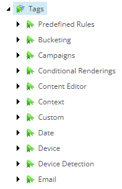
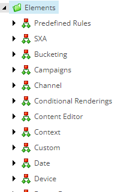
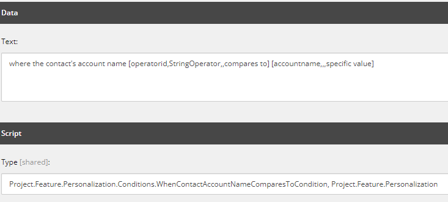
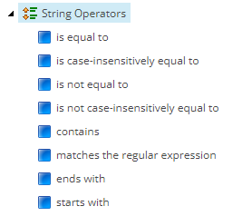

Photo by <a href="https://unsplash.com/@storyfuel?utm_source=unsplash&utm_medium=referral&utm_content=creditCopyText">Melanie Deziel</a> on <a href="https://unsplash.com/photos/U33fHryBYBU?utm_source=unsplash&utm_medium=referral&utm_content=creditCopyText">Unsplash</a>
  

In this blog post, I will share how to create custom personalization and segmentation rules in Sitecore. 
Personalization rules are used to create conditional renderings to personalize and control contacts' experiences. Segmentation rules are used in ListManager to add segments to lists. Also can be used as a condition in Marketing Automation.

# Personalization Rules

First, we need to create a new Tag, that will serve as a section in Rule Editor, under /sitecore/system/Settings/Rules/Definitions/Tags:



Then, we need to create a new Element Folder with the same name under /sitecore/system/Settings/Rules/Definitions/Elements:



Under this new Element Folder, there is a Default item under Tags, we need to select our custom Tag here. We need to do the same for /sitecore/system/Settings/Rules/Conditional Renderings/Tags/Default. So that we can use this item while content editing.
After that, we can start adding new rules under Element Folder:



Text is what user is going to see when they opened Rule Editor. Here we mention that they can use Sitecore's own String Operator (defined under /sitecore/system/Settings/Rules/Definitions/String Operators):



Then we use our parameter name 'accountname' that we are going to use for comparison in the code. 
We created these conditions for both custom facets and also Sitecore's own Contact Facets.
To be able to use the custom facets, we need to load them in the session. As described here [link](https://doc.sitecore.com/xp/en/developers/93/sitecore-experience-platform/load-facets-into-session.html)

```xml
<?xml version="1.0" encoding="utf-8" ?>
<configuration xmlns:patch="http://www.sitecore.net/xmlconfig/">
  <sitecore>
    <dataAdapterManager defaultProvider="xconnect">
      <providers>
        <add name="xconnect" type="Sitecore.Analytics.XConnect.DataAccess.XConnectDataAdapterProvider, Sitecore.Analytics.XConnect">
          <facets hint="raw:AddFacet">
            <facet facetKey="YourNewFacetKey"/>
          </facets>
        </add>
      </providers>
    </dataAdapterManager>
  </sitecore>
</configuration>
```
For Sitecore-defined facets, we don't need to do this step since they are already included.
Here is the example code for the custom facet as a condition:

```C#
public class WhenContactAccountNameComparesToCondition<T> : StringOperatorCondition<T> where T : RuleContext
    {
        public string AccountName { get; set; }

        protected override bool Execute(T ruleContext)
        {
            var contact = Tracker.Current?.Contact;

            if (contact == null || contact.IdentificationLevel == ContactIdentificationLevel.Anonymous)
            {
                Log.Info(this.GetType() + ": contact is null or anonymous", this);
                return false;
            }

            var xConnectFacet = Tracker.Current.Contact.GetFacet<Sitecore.Analytics.XConnect.Facets.IXConnectFacets>("XConnectFacets");
            if (xConnectFacet != null)
            {
                if (xConnectFacet.Facets != null && xConnectFacet.Facets.ContainsKey(ExtendedContact.DefaultFacetKey))
                {
                    ExtendedContact extendedContact = xConnectFacet.Facets[ExtendedContact.DefaultFacetKey] as ExtendedContact;
                    if (!string.IsNullOrEmpty(extendedContact?.AccountName))
                    {
                        return this.Compare(extendedContact.AccountName, AccountName);
                    }
                }
            }

            return false;
        }
    }
```
First, the custom condition needs to inherit StringOperatorCondition and implement Execute function. 
In our implementation, if a user has a value for any facet, that means it's identified so after checking if the contact is null, we needed to add a check for identification.
## Accessing custom facets in session
After loading custom facets into the session, we need to access them. As Sitecore describes here [link](https://doc.sitecore.com/xp/en/developers/93/sitecore-experience-platform/accessing-facets-in-session.html), we used IXConnectFacets to fetch the facets. Since in Sitecore 9.3 and later, legacy facet classes such as IContactPersonalInfo are no longer available. 

So instead of reaching a facet like the following as described here [link](https://sitecore-community.github.io/docs/xDB/contact-facets/), we must reach like this:

```C#
var xConnectFacet = Tracker.Current.Contact.GetFacet<Sitecore.Analytics.XConnect.Facets.IXConnectFacets>("XConnectFacets");
if (xConnectFacet != null)
{
      if (xConnectFacet.Facets != null && xConnectFacet.Facets.ContainsKey(EmailAddressList.DefaultFacetKey))
      {
         EmailAddressList addressList = xConnectFacet.Facets[EmailAddressList.DefaultFacetKey] as EmailAddressList;
      }
}
```

# Segmentation Rules

We can also create segmentation rules, but they need to be created differently than personalization rules and extend different classes. 

Sitecore already has detailed documentation about how to create one using a custom facet here [link](https://doc.sitecore.com/xp/en/developers/90/sitecore-experience-platform/create-a-custom-condition-and-segmentation-query.html)

But there are a few things that need to be mentioned that are not included in the documentation. 
This example uses string comparison to compare custom facet values:

```C#
public class CrmAccountNameComparesToCondition : ICondition, IContactSearchQueryFactory
{
    public string AccountName { get; set; }
    public StringOperationType Comparison { get; set; }

    // Evaluates condition for single contact
    public bool Evaluate(IRuleExecutionContext context)
    {
        var contact = context.Fact<Contact>();

        return Comparison.Evaluate(contact.GetFacet<ExtendedContact>(ExtendedContact.DefaultFacetKey)?.AccountName, AccountName);
    }

    // Evaluates contact in a search context
    // IMPORTANT: Use InteractionsCache() facet rather than contact.Interactions as some search providers do not provide joins.
    public Expression<Func<Contact, bool>> CreateContactSearchQuery(IContactSearchQueryContext context)
    {
        return contact => Comparison.Evaluate(contact.GetFacet<ExtendedContact>(ExtendedContact.DefaultFacetKey).AccountName, AccountName);
    }
}
```
This example just checks if contact has a value at all:

```C#
public class ContactFirstNameNotNullOrEmpty : ICondition, IContactSearchQueryFactory
{
    public bool Evaluate(IRuleExecutionContext context)
    {
        var facet = context.Fact<Contact>().Personal();
        if (facet == null)
        {
            return false;
        }
        return !string.IsNullOrEmpty(facet.FirstName);
    }

    public Expression<Func<Contact, bool>> CreateContactSearchQuery(IContactSearchQueryContext context)
    {
        return (Expression<Func<Contact, bool>>)(contact => contact.Personal().FirstName != null && contact.Personal().FirstName != string.Empty);
    }
}
```
The first thing to mention here is, Evaluate function is used by MAT, CreateContactSearchQuery function is used by ListManager.

### Check interactions

In Sitecore documentation, there is one more check for the search query:

```C#
&& contact.InteractionsCache().InteractionCaches.Any()
```

This code snippet checks if the contact has any interactions. While this might be helpful for some cases, it also means that if we import the contacts from a list, these contacts will not be shown in the List Manager when we segment them, since they do not have interactions yet.

### YourLinqIsTooStrongException

If we do not want to use a comparison and rather check if the facet is null or empty, we can use the second code snippet. But as you can see instead of using the following code:

```C#
string.IsNullOrEmpty(contact.Personal().FirstName)
```

we have to keep it simple and use the following:
```C#
contact.Personal().FirstName != null && contact.Personal().FirstName != string.Empty
```
This is because the Sitecore predicate engine is throwing an error 'YourLinqIsTooStrongException' in Rule Editor and basically wants us to write simplified code here.

### PII Sensitive Data

List Manager relies on data being available on the xDB index. For some facets such as Personal Information, there are sensitive data, therefore not available in xDB indexes by default. These are FirstName, LastName, MiddleName, Nickname, and Birthdate. Sitecore marks them as PIISensitive and can be found on Sitecore.XConnect.Collection.Model. 

If we like to see the search results depending on PIISensitive data, we can follow the following documentation from Sitecore [link](https://doc.sitecore.com/xp/en/developers/91/sitecore-experience-platform/enable-indexing-of-pii-sensitive-data-in-the-xdb-index.html)

Note that this setting is different in an on-premise environment. Also, rebuilding the xDB search index is needed.

