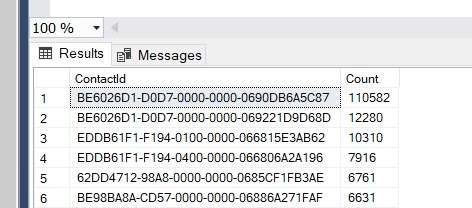

Photo by panumas nikhomkhai: https://www.pexels.com/@cookiecutter/ 
  

## xDB Performance Troubleshooting
On this Blog entry we will dive into the fascinating world of Sitecore xDB – a crucial component of the Sitecore XP platform that will quietly gather comprehensive data about our website's visitors. With a ton of data being stored – and especially if you don’t have a proper retention policy set up in place - it's crucial to keep it in tip-top shape to avoid any performance hiccups.

Some symptoms that something is not fine on xDB are logs flooded with errors such as “The attempt to recover from previous failure has not been successful. There will be another attempt.”, or other Execution Timeout messages. Another common symptom is that rebuilding the xDB search index doesn’t work properly or is extremely slow.

Bellow we will have some steps to share with you that have proven to be absolute lifesavers in our past experiences.

### Check for contacts with excessive number of interactions in xDB
Sitecore explains in detail how to check and identify these suspicious contacts [here](https://support.sitecore.com/kb?id=kb_article_view&sysparm_article=KB0417184#AnalyzingTheData).
In short, we need to query the xDB Interactions table directly, using the query bellow


SELECT TOP (100) ContactId, COUNT(ContactId) as Count
FROM [xdb_collection].[Interactions]
GROUP BY ContactId
ORDER BY Count DESC



It’s expected that most contacts will have less than 1k interactions. According to Sitecore support, contacts with more than 1K interactions can be considered suspicious. They are probably not a real user but a bot or another automated process instead. These can significantly contribute with a lot of invalid data and need to be purged from the xDB.

### Clean xDB of suspicious contacts

If you stumble upon contacts that raise suspicions about their authenticity, it's essential to take action you should either delete the contact or at least get rid of the excessive amount of interactions.
You can easily do this by using the xConnect API. Bellow there is a quick code snipped that demonstrates how to do it. Sitecore also has the whole process documented [here](https://doc.sitecore.com/xp/en/developers/103/sitecore-experience-platform/deleting-contacts-and-interactions-from-the-xdb.html)



using (var client = new XConnectClient(cfg))
            {
                try
                {
                    string contactID = "xxxxxxxx-xxxx-xxxx-xxxx-xxxxxxxxxxxx";
                    Console.WriteLine("Finding contact with ID: " + contactID);
                    var reference = new Sitecore.XConnect.ContactReference(Guid.Parse(contactID));
                    Task<Sitecore.XConnect.Contact> contactTask = client.GetAsync<Sitecore.XConnect.Contact>(reference, new ContactExecutionOptions(new ContactExpandOptions() { }));
                    Contact contact = await contactTask;
                    if (contact != null)
                    {
                        Console.WriteLine("Contact with ID: " + contactID + "Found.");
                        Console.WriteLine("Will delete the contact");

                        client.DeleteContact(contact);
                        await client.SubmitAsync();

                        Console.WriteLine("Contact deleted with success!");
                    }
                    else
                    {
                        Console.WriteLine("Contact with ID: " + contactID + " was not found");
                    }
                }
                catch (XdbExecutionException ex)
                {
                    Console.WriteLine(ex.Message);
                }
            }



In some extreme cases, where contacts will have thousands of interactions, we have experienced the API to fail due to timeout. If you face such a situation, you can also delete the contacts directly from the xDB using the following SQL queries:


delete FROM [xdb_collection].[InteractionFacets] where ContactId = '<contactID>'
delete FROM [xdb_collection].[ContactIdentifiers] where ContactId = '<contactID>'
delete FROM [xdb_collection].[ContactFacets] where ContactId = '<contactID>'
delete FROM [xdb_collection].[Interactions] where ContactId = '<contactID>'
delete FROM [xdb_collection].[Contacts] where ContactId = '<contactID>'
delete FROM [xdb_collection].[ContactIdentifiersIndex] where ContactId = '<contactID>'


Finally, after cleaning up xDB, you should [reindex the xDB search index](https://doc.sitecore.com/xp/en/developers/103/sitecore-experience-platform/rebuilding-the-xdb-search-index.html).
 
### Defragmenting xDB 

Having contacts with excessive interactions are also very likely to fragment your database. If your fragmentation index is high – like on the image bellow - you will need to reorganize or rebuild the DBs indexes.

There are several ways to do this. The following [link](https://www.sqlshack.com/how-to-identify-and-resolve-sql-server-index-fragmentation) provides an excellent guide on how to check and address fragmentation

### Enable AUTO_UPDATE_STATISTICS_ASYNC

If after cleaning the xDB from suspicious contacts and taking care of the shard DBs fragmentation you still experience performance issues and/or are not able to rebuild the xDB index, don't lose heart! There's still a glimmer of hope.

You can try to enable AUTO_UPDATE_STATISTICS_ASYNC by running the following query: 

ALTER DATABASE <DBNAME> SET AUTO_UPDATE_STATISTICS_ASYNC ON.


When you enable this feature, you're giving [SQL Server Query Optimizer](https://learn.microsoft.com/en-us/sql/relational-databases/query-processing-architecture-guide?view=sql-server-ver16) the green light to skip the wait for statistics updates. It immediately leaps into action, running your query with the freshest stats on hand. Meanwhile, behind the scenes, it still triggers a separate to update those statistics asynchronously.

This has been suggested to us by Sitecore support with the disclaimer that it’s still being fully tested on Sitecore side and planned to be included in a future release (after Sitecore XP 10.3). But the performance improvements are dramatic. As you can see on the picture bellow, DTU usage dropped drastically after we activated this setting.

### Increase the number of shards

If none of the steps above could solve your issues, it might very well be that your current set up is not adequate to your website’s traffic and you might need to consider increasing the number of shards on the xDB.

Unfortunately, Sitecore has no documentation on the relation between traffic and optimal number of shards. But a good indicator can be the size of the shard DBs. If you are reaching a size of hundreds of gigabytes or reaching the terabyte threshold, increasing the number of shards might be something to consider.

Additionally, it’s also worth mentioning Sitecore advises creating separate elastic pool databases for Sitecore instances (CM, CD, Reporting, and Processing) and for xDB databases (Shard0, Shard1, Processing.Pools, ReferenceData, etc.).

## Conclusion

To wrap things up, these are the steps that have come to our rescue when it comes to diagnosing and fixing xDB performance problems. We're crossing our fingers that they prove just as handy for you too!

Interested in diving deeper into this or any other Sitecore topic? We'd love to share more about Merkle and our expertise with Sitecore! Don't hesitate to contact with us through this [link](https://www.merkle.com/dach/en/services/sitecore)! We're eager to connect and share insights with you.
